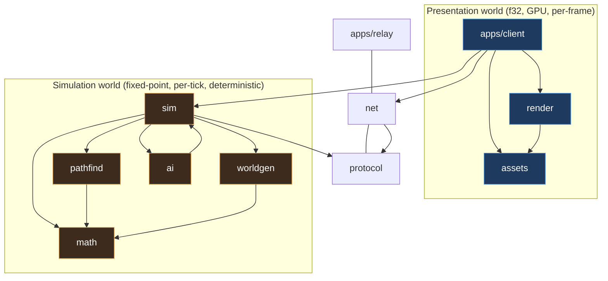
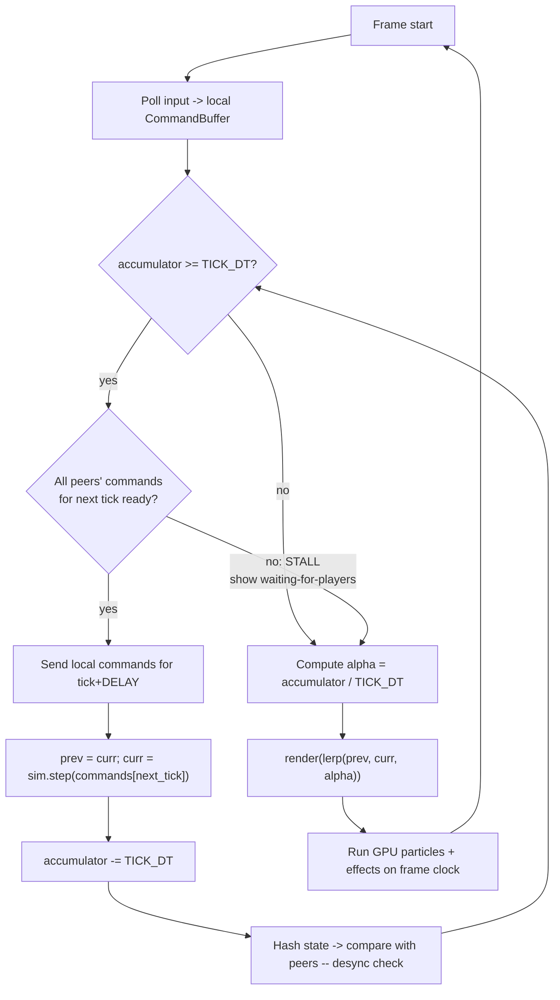
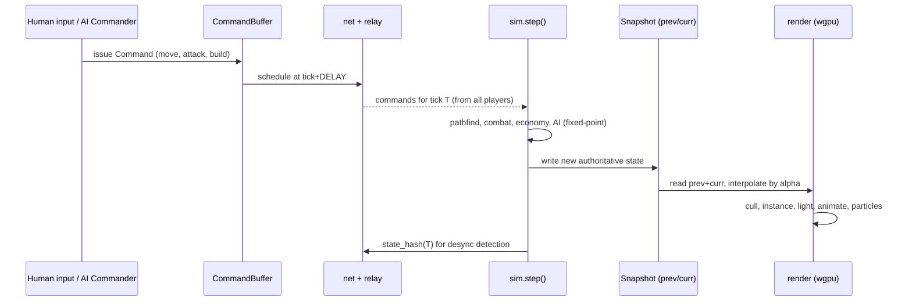

# Architecture — Deterministic Lockstep RTS (Rust + wgpu)

> A StarCraft-class real-time strategy engine: deterministic lockstep simulation,
> 100s–1000s of units, 120–160 FPS rendering, large (flat **or** spherical) maps,
> procedural generation, and first-class AI bots — built on **Rust** and **wgpu**
> (no Bevy).

This is the top-level map. Each requirement from the brief has a dedicated chapter
under [`docs/architecture/`](docs/architecture/). Read the overview first; it
establishes the two invariants that every other chapter depends on.

---

## 1. The two invariants

Everything in this design follows from two rules. If you remember nothing else,
remember these.

### Invariant A — Two worlds, one wall

The codebase is split into a **Simulation world** and a **Presentation world**,
separated by a hard wall.

| | Simulation world | Presentation world |
|---|---|---|
| **Purpose** | Game truth (what *is*) | Game appearance (what you *see*) |
| **Numbers** | Fixed-point integers only | `f32` / `f64`, freely |
| **Clock** | Fixed timestep, ~20–30 Hz | Display rate, 120–160 Hz |
| **Determinism** | Bit-identical on every machine | Irrelevant; may differ per machine |
| **Inputs** | Commands only | Reads a snapshot of the sim |
| **Examples** | unit position, HP, pathing, RNG, AI decisions | camera, interpolation, particles, animation blending, screen-shake, sound |
| **Crate** | `sim`, `math`, `pathfind`, `ai`, `worldgen` | `render`, `app`, `assets` |

> **The wall:** the Presentation world may *read* the Simulation world. It may
> **never** write to it, and nothing it computes (a float, a GPU result, a frame
> time) may flow back across the wall. Break this once and multiplayer desyncs.

### Invariant B — Commands in, snapshots out

The simulation is a pure function:

```
next_state = step(current_state, commands_for_this_tick)
```

- **No wall-clock time, no I/O, no randomness** enters `step()` except through
  `commands` and a seeded PRNG that lives *inside* the state.
- The network therefore transports **only commands** (a few bytes each), never
  unit positions. This is what makes 1000s of units affordable online and what
  makes replays a 1 KB file. See [Networking](docs/architecture/03-networking-lockstep.md).

These two invariants are the reason a lockstep RTS can exist at all. Chapter
[01 — Determinism](docs/architecture/01-determinism.md) is the rulebook that keeps
them true.

---

## 2. Design pillars

1. **Determinism is a feature, not a detail.** It is tested in CI from day one
   (run the same command log on Linux/Windows/macOS/WASM → identical state hash).
2. **Decouple simulation rate from frame rate.** Sim ticks slowly and exactly;
   rendering interpolates and runs as fast as the GPU allows.
3. **Scale by amortization, not brute force.** 1000s of units come from GPU
   instancing + indirect culling (render) and flow fields + spatial hashing
   (sim) — never per-unit draw calls or per-unit A*.
4. **AI is a player, not a subsystem.** Bots emit the same `Command`s a human
   does, through the same API. Built alongside everything else, they double as
   our automated test harness (headless bot-vs-bot).
5. **One codebase, native + web.** wgpu (Vulkan/Metal/DX12/WebGPU) and WebRTC
   give us desktop and browser from the same source.

---

## 3. Workspace layout

A Cargo workspace. Dependency direction is enforced: **the simulation crates know
nothing about rendering, windowing, or networking.**

```
rts-99-jam/
├── crates/
│   ├── math        # fixed-point scalar/vec/quat + deterministic trig (CORDIC/LUT)
│   ├── sim         # deterministic core: world state, systems, step(). NO I/O.
│   ├── protocol    # Command/Message types, wire format, versioning (serde)
│   ├── pathfind    # flow fields, hierarchical A*, navmesh, ORCA avoidance
│   ├── worldgen    # deterministic procedural maps (flat + spherical)
│   ├── ai          # Commander trait + bot brains (run inside sim)
│   ├── net         # transport (WebRTC/WS/QUIC) + lockstep turn coordinator
│   ├── assets      # glTF/texture load, animation baking pipeline
│   ├── render      # wgpu render graph, instancing, lighting, particles
│   ├── replay      # record/playback of command logs
│   └── testkit     # determinism harness, headless runner, fuzzing
├── apps/
│   ├── client      # winit + render + net glue; the game loop lives here
│   └── relay       # signaling + command-relay + matchmaking server (tokio)
├── assets/         # models, textures, baked animation atlases
└── docs/architecture/
```



**Forbidden edges** (CI-enforced): `sim → render`, `sim → net`, `sim → wgpu`,
`sim → winit`, `sim → std::time`, any `f32`/`f64` in `sim`/`math`/`pathfind`.

---

## 4. The dual-clock game loop

This single loop is where the two invariants meet. The simulation advances in
discrete ticks **only when the network has delivered every player's commands for
that tick** (the lockstep gate). Rendering runs every frame and interpolates
between the two most recent sim states.



```rust
// apps/client — the heartbeat. Simplified.
const TICK_HZ: u32 = 25;
const TICK_DT: Fixed = Fixed::ONE / TICK_HZ;   // sim timestep (fixed-point)
const INPUT_DELAY: u32 = 3;                      // ticks of latency we hide

let mut accumulator = 0.0f64;                    // wall time is PRESENTATION-only
let mut prev = sim.snapshot();
loop {
    let dt = frame_timer.tick();                 // real seconds, f64 — never enters sim
    input.drain_into(&mut local_cmds);
    accumulator += dt;

    while accumulator >= TICK_DT.to_f64() {
        if !net.commands_ready(sim.tick() + 1) {
            break;                               // lockstep stall — render last good state
        }
        net.send(sim.tick() + INPUT_DELAY, local_cmds.take());
        let cmds = net.commands_for(sim.tick() + 1);
        prev = sim.snapshot();
        sim.step(cmds);                          // <-- the ONLY mutation of game truth
        accumulator -= TICK_DT.to_f64();
        net.report_checksum(sim.tick(), sim.state_hash());
    }

    let alpha = (accumulator / TICK_DT.to_f64()) as f32;
    renderer.draw(&prev, sim.current(), alpha);  // interpolated, 120–160 FPS
}
```

Why this shape:

- **Determinism**: `sim.step` only ever sees commands. The variable `dt`,
  `accumulator`, and `alpha` are presentation-only and never touch the sim.
- **High FPS over a slow sim**: at 25 Hz sim and 144 Hz display we render ~6
  interpolated frames per tick — smooth motion without simulating more often.
- **Latency hiding**: commands issued now execute `INPUT_DELAY` ticks later, so
  remote commands arrive "just in time." See
  [Networking](docs/architecture/03-networking-lockstep.md).

---

## 5. End-to-end data flow



Note that AI and human input enter at the **same point** (`CommandBuffer`) — the
core of "AI is a player." See [AI Bots](docs/architecture/09-ai-bots.md).

---

## 6. Chapter index

| # | Chapter | Covers (from the brief) |
|---|---------|--------------------------|
| 00 | [Overview](docs/architecture/00-overview.md) | Vision, glossary, references, reading order |
| 01 | [Determinism](docs/architecture/01-determinism.md) | The foundation: fixed-point, RNG, ordering, checksums, pitfalls |
| 02 | [Simulation & data model](docs/architecture/02-simulation.md) | "Lots of units 100s–1000s", ECS/SoA, scheduling |
| 03 | [Networking & lockstep](docs/architecture/03-networking-lockstep.md) | "Multiplayer (WebRTC/WS, P2P + server assist)", replays |
| 04 | [Rendering (wgpu)](docs/architecture/04-rendering-wgpu.md) | "3D model, shaders", "vertex lighting", high frame rate, scale |
| 05 | [Animation](docs/architecture/05-animation.md) | "Animations" at crowd scale |
| 06 | [Particles](docs/architecture/06-particles.md) | "Particles" (GPU-driven, cosmetic) |
| 07 | [Pathfinding & navigation](docs/architecture/07-pathfinding-navigation.md) | "Spherical A*, navmesh, terrain nav, collision avoidance" |
| 08 | [Procedural generation](docs/architecture/08-procedural-generation.md) | "Large maps", "procedural map generation" |
| 09 | [AI bots](docs/architecture/09-ai-bots.md) | "AI bot support (build alongside everything)" |
| 10 | [Roadmap, testing & tooling](docs/architecture/10-roadmap-testing.md) | Milestones, determinism CI, profiling |

---

## 7. Technology choices at a glance

| Concern | Choice | Why |
|---|---|---|
| GPU | **wgpu** + WGSL | Cross-platform (Vulkan/Metal/DX12/WebGPU); native + browser |
| Windowing/input | **winit** | The standard; wgpu-friendly; web-capable |
| Sim math | **fixed-point** (`fixed` crate, I40F24 / I32F32) + **CORDIC** trig | Bit-identical cross-platform; no float drift |
| Render math | **glam** (`f32`) | Fast, ergonomic, SIMD; presentation-only |
| RNG (sim) | pinned **PCG32 / SplitMix64** (hand-rolled) | Stable algorithm, never changes under us |
| State hash | pinned **xxHash / FNV-1a**, ordered traversal | Desync detection + replay verification |
| Net transport | **WebRTC DataChannels** (reliable-ordered) via `str0m`; QUIC (`quinn`) native fallback; `tokio-tungstenite` WS for signaling | One transport for native + web; NAT traversal; reliable command stream |
| Server | **tokio** relay (signaling + command relay + matchmaking) | Server-assist authority without a heavy sim server |
| Serialization | `serde` + `bincode` (protocol), `rkyv` (assets, zero-copy) | Compact commands; fast asset loads |
| Assets | `gltf`, `image` | Standard model/animation/texture pipeline |
| ECS | custom **SoA arena** in `sim` (deterministic), optional `hecs` for render scene | Determinism needs controlled iteration order |
| Pathfinding | flow fields + hierarchical A* + ORCA (all fixed-point) | RTS-scale group movement; PA-style spherical option |
| Parallelism | `rayon` in presentation/asset/particle prep; sim single-threaded first, then *deterministic* data-parallelism | Determinism forbids naive threading in sim |
| Profiling | `tracing` + **Tracy** (`tracing-tracy`), `puffin` | Frame + tick profiling |

Rationale and alternatives for each live in the relevant chapter.

---

## 8. Open decisions (confirm to finalize)

These are genuine forks where your call changes the design. The docs cover all
branches; pick to prune.

1. **Map topology default.** Flat (StarCraft) is the default; spherical/planetary
   (Planetary Annihilation) is supported via a `Topology` abstraction in
   `pathfind`/`worldgen`. Confirm whether spherical is *the* mode or an option.
   ("Spherical A*" in the brief suggests at least an option — see
   [Ch.07](docs/architecture/07-pathfinding-navigation.md).)
2. **Web/WASM as a first-class target?** If yes, WebRTC is mandatory and a few
   render features tighten to the WebGPU subset. If native-only, QUIC simplifies
   networking. Default assumption: **both**.
3. **Netcode model.** Default is **deterministic lockstep + input delay** (correct
   for RTS scale). Rollback (GGPO-style) is discussed but *not* recommended for
   1000s of units — re-simulating crowds on every rollback is too costly.
4. **Art style.** "Lots of vertex lighting" reads as a stylized/low-poly look,
   which is also the cheapest path to 1000s of units at 144 FPS. Confirm if you
   instead want full PBR per-pixel (more cost, fewer units).

None of these block starting at [Milestone 0](docs/architecture/10-roadmap-testing.md):
the deterministic core, math, and test harness are identical under every branch.

---

## 9. Where to start building

Follow the [roadmap](docs/architecture/10-roadmap-testing.md). Milestone 0 is the
keystone: **prove determinism before writing a single shader.** A headless `sim`
that runs a recorded command log to an identical state hash on two operating
systems is the foundation the entire engine stands on.
