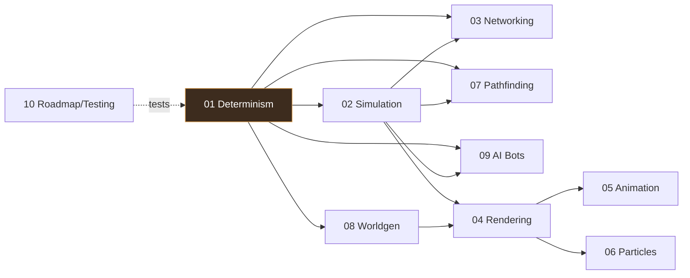

# 00 — Overview, Glossary & References

[← Back to ARCHITECTURE.md](../../ARCHITECTURE.md)

## Vision

A deterministic, lockstep real-time strategy engine in the lineage of *StarCraft*,
*Supreme Commander*, and *Planetary Annihilation*, written in **Rust** with a
**wgpu** renderer (deliberately not Bevy — we want explicit control over the
render graph, the simulation, and the determinism boundary).

The defining tension of the brief is this:

> 1000s of units, online, at 120–160 FPS, on large maps.

You cannot send 1000 unit positions to every player every frame — that is
megabytes per second per player. The only known solution at this scale is
**deterministic lockstep**: every machine runs the identical simulation and the
network carries only the handful of *commands* players issue. That single
decision cascades into every other chapter, which is why
[Determinism](01-determinism.md) comes first.

## How the chapters relate

Determinism is the root. Rendering, animation, and particles hang off the
presentation side and never feed back. The roadmap chapter wraps the whole thing
in tests.

## Reading order

- **Building the engine?** 01 → 02 → 03 → 07 → 04 → the rest, following the
  [roadmap](10-roadmap-testing.md).
- **Reviewing the design?** Read this, then [ARCHITECTURE.md §1–4](../../ARCHITECTURE.md),
  then the chapter for your area of concern.
- **Just want the netcode?** [03](03-networking-lockstep.md), but read
  [01](01-determinism.md) first or none of it will make sense.

## Glossary

| Term | Meaning |
|---|---|
| **Tick** | One step of the simulation. Fixed duration (e.g. 1/25 s). The unit of game time. |
| **Frame** | One rendered image. Many frames per tick at high FPS. |
| **Lockstep** | All peers simulate tick *T* only after every peer's commands for *T* are known. |
| **Command** | A player intent: *move these units here*, *build that*, *attack*. The only thing networked. |
| **Input delay** | Commands issued at tick *T* execute at *T + delay*, hiding network latency. |
| **Desync** | Two peers' simulations diverge. Fatal in lockstep; detected via state hashes. |
| **Snapshot** | A read-only view of sim state for a tick, used by the renderer for interpolation. |
| **Fixed-point** | Integer-backed fractional numbers; deterministic across CPUs (unlike floats). |
| **Flow field** | A grid of direction vectors pointing toward a goal; lets 1000s of units path cheaply. |
| **Commander** | The interface both human input and AI implement to produce commands. |
| **Topology** | Whether the world is a flat plane or a sphere (planet). |
| **VAT / bone texture** | Baked animation data sampled in shaders so animation cost is independent of unit count. |

## Reference games & techniques (prior art worth studying)

- **StarCraft / Brood War, Age of Empires** — classic deterministic lockstep with
  input delay; the model this engine follows. (See Bettner & Terrano's "1500
  Archers on a 28.8" — the canonical lockstep RTS paper.)
- **Supreme Commander** — flow-field-style movement, very large unit counts.
- **Planetary Annihilation** — *spherical* planets, flow-field pathfinding on a
  geodesic grid, 1000s of units. The reference for the "spherical" requirement.
- **GGPO / rollback netcode** — the alternative to lockstep; great for fighting
  games, the wrong tool for crowd-scale RTS (see [03](03-networking-lockstep.md)).
- **"Fix Your Timestep!" (Gaffer on Games)** — the fixed-update + interpolation
  loop in [ARCHITECTURE.md §4](../../ARCHITECTURE.md).
- **Recast/Detour** — navmesh generation; we port the *ideas*, not the C++.
- **ORCA / RVO2** — reciprocal collision avoidance; **our chosen local-avoidance
  algorithm**, reimplemented in fixed-point ([Ch.07 §5](07-pathfinding-navigation.md)).

## Non-goals (initially)

- A full PBR cinematic pipeline (stylized/vertex-lit look is the chosen aesthetic
  and the performance budget — see [04](04-rendering-wgpu.md)).
- Rollback netcode (explicitly out; see [03](03-networking-lockstep.md)).
- A dedicated authoritative *simulation* server (the server **relays** commands;
  it does not simulate — see [03](03-networking-lockstep.md)).
- Modding/scripting runtime (designed for, but not built early; note the
  determinism constraint it would impose).
