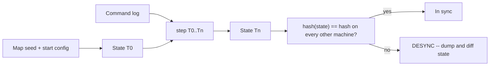

# 01 — Determinism: The Foundation

[← Back to ARCHITECTURE.md](../ARCHITECTURE.md) · [Prev: Overview](00-overview.md) · [Next: Simulation](02-simulation.md)

> If the simulation is not bit-for-bit identical on every machine, lockstep
> multiplayer cannot work, replays cannot work, and desyncs become unfixable.
> This chapter is the rulebook. Every other chapter obeys it.

A simulation is **deterministic** if, given the same initial state and the same
sequence of commands, it produces the *exact same* state — byte for byte — on
every CPU, OS, compiler, and run. Not "approximately the same." Identical.



---

## 1. Why floating point is banned in the simulation

IEEE-754 floats give *almost* the same answer everywhere — and "almost" is fatal
when a 1-ULP difference, compounded over 10,000 ticks across 1000 units,
relocates an army. Float results legitimately differ across machines because of:

- **FMA contraction**: `a*b + c` may fuse into one rounded op on one CPU and two
  on another. The compiler decides, and CPUs differ.
- **x87 vs SSE vs NEON**: 80-bit intermediates vs 64-bit; different rounding.
- **Transcendentals**: `sin`, `cos`, `sqrt`, `exp` are *not* specified to the last
  bit by IEEE-754. Every libm differs. `f32::sin` on Linux ≠ on Windows ≠ on WASM.
- **Compiler flags / fast-math / LTO / target-cpu**: reorder and re-associate FP.
- **Auto-vectorization**: different reduction order → different rounding.

You can *sometimes* tame this (strict FP, no fast-math, software transcendentals),
but it is fragile and one careless `* 0.5` reintroduces drift. We don't fight it.
**The simulation uses fixed-point integers, where every operation is exact and
identical on all hardware.**

> Floats are *fine* and encouraged in the **presentation** world (rendering,
> camera, interpolation, particles). They never cross back into the sim.

---

## 2. Fixed-point math (`crates/math`)

Represent fractional numbers as integers scaled by a power of two.

- **Type**: 64-bit signed fixed-point. Recommended `I40F24` (40 integer bits,
  24 fraction bits) or `I32F32`. 64 bits avoids overflow on **large maps**
  (millions of sub-units across the map) while keeping ~6 decimal digits of
  fractional precision.
- **Crate**: the [`fixed`](https://docs.rs/fixed) crate provides battle-tested
  `FixedI64<N>` types. All ops reduce to integer arithmetic → deterministic.
- Wrap it so the rest of the code is decoupled from the backing type:

```rust
// crates/math/src/scalar.rs
pub type Fixed = fixed::types::I40F24;          // single source of truth

#[derive(Clone, Copy, PartialEq, Eq, Hash, Debug, Default)]
pub struct Fx(pub Fixed);

impl Fx {
    pub const ZERO: Fx = Fx(Fixed::ZERO);
    pub const ONE:  Fx = Fx(Fixed::ONE);
    pub fn from_int(i: i32) -> Self { Fx(Fixed::from_num(i)) }
    pub fn to_f32(self) -> f32 { self.0.to_num() }   // PRESENTATION ONLY
}
// + Add/Sub/Mul/Div via the fixed crate (saturating or checked — pick one and
//   keep it everywhere; overflow behavior must be deterministic too).
```

Then `Vec2/Vec3/Quat` built on `Fx`, and a fixed-point transform for units.

### Deterministic transcendentals

`sqrt`, `sin`, `cos`, `atan2`, normalization — needed for movement and rotation —
must be deterministic. Options:

1. **CORDIC** (the [`cordic`](https://docs.rs/cordic) crate works on `fixed`
   types): iterative integer algorithm, identical on all hardware. Recommended
   for trig, atan2, hypot.
2. **Integer sqrt**: Newton/bit-by-bit on the raw integer — exact and portable.
3. **Lookup tables**: precomputed fixed-point `sin`/`cos` tables for angles
   quantized to N steps; great when you also want to *quantize* facings (units
   turn in fixed increments — common and cheap in RTS).

Wrap them in `math` so the sim never calls a float trig function:

```rust
// crates/math/src/trig.rs — deterministic, fixed-point.
pub fn sin(a: Fx) -> Fx { Fx(cordic::sin(a.0)) }
pub fn sqrt(x: Fx) -> Fx { Fx(cordic::sqrt(x.0)) }
pub fn atan2(y: Fx, x: Fx) -> Fx { Fx(cordic::atan2(y.0, x.0)) }
```

---

## 3. Deterministic RNG

`rand::thread_rng()` is forbidden in the sim (seeded from the OS, non-portable).
The PRNG lives **inside the simulation state** and is part of the hashed state.

- **Pin a stable algorithm** you control the source of — e.g. a hand-rolled
  **PCG32** or **SplitMix64**. Do *not* depend on a crate whose default algorithm
  could change in a minor version.
- Seed it from the shared **map seed** at game start (same on all peers).
- Every random draw advances the *same* generator in the *same* order on every
  machine — which means draw order is itself part of determinism (see §4).

```rust
// crates/sim/src/rng.rs — part of the World state, hashed and serialized.
#[derive(Clone)]
pub struct DetRng { state: u64 }
impl DetRng {
    pub fn new(seed: u64) -> Self { Self { state: seed.wrapping_add(0x9E3779B97F4A7C15) } }
    pub fn next_u64(&mut self) -> u64 {          // SplitMix64 — pinned, never changes
        self.state = self.state.wrapping_add(0x9E3779B97F4A7C15);
        let mut z = self.state;
        z = (z ^ (z >> 30)).wrapping_mul(0xBF58476D1CE4E5B9);
        z = (z ^ (z >> 27)).wrapping_mul(0x94D049BB133111EB);
        z ^ (z >> 31)
    }
    pub fn range(&mut self, n: u32) -> u32 { (self.next_u64() % n as u64) as u32 }
    pub fn chance(&mut self, fx: Fx) -> bool { /* fixed-point compare */ unimplemented!() }
}
```

> **Cosmetic randomness** (particle jitter, idle animation variation, screen
> shake) uses a *separate*, presentation-side RNG seeded however you like — it
> must never touch `DetRng`.

---

## 4. Deterministic ordering & data structures

Same math, same RNG — but iterate entities in a different order and you desync.
The rules:

- **No `std::HashMap`/`HashSet` iteration in the sim.** Their default hasher is
  randomly seeded per process → different iteration order per run. Banned.
- Allowed: `Vec` (index order), `BTreeMap`/`BTreeSet` (key order), or a
  fixed-seed deterministic hasher (`rustc-hash`/`FxHashMap`) **only if you never
  iterate it for sim-affecting work** (lookups by key are fine).
- **Entities** live in a generational arena / slotmap with **deterministic ID
  allocation** (a deterministic free list, not address-based). See
  [Simulation](02-simulation.md).
- **Systems run in a fixed, declared order.** Combat before movement before
  death-resolution, etc. — a static schedule, never data-dependent.
- **Stable sorts** with explicit tie-breakers (e.g. by `EntityId`) anywhere
  order could otherwise be ambiguous.
- **Spatial queries** (neighbors for avoidance/targeting) must return results in
  a deterministic order — sort candidates by `EntityId` before acting on them.

---

## 5. Other banned inputs to `step()`

`step(state, commands)` must be a pure function of its arguments. Therefore, **in
the sim, never**:

- read `std::time::*`, frame delta, or any wall clock (time is `tick` count only);
- read files, env vars, network, or any I/O;
- branch on pointer/address values, allocation order, or `Vec` capacity;
- use uninitialized memory or rely on `HashMap` capacity/iteration;
- spawn threads whose results merge in non-deterministic order (see §7);
- call any `f32`/`f64` op (enforced by lint — see §8).

---

## 6. State hashing & desync detection

Every tick, hash the simulation state and exchange the hash with peers (cheaply —
it's a few bytes). Mismatch = desync caught *immediately*, at the tick it
happened, not 10 minutes later.

- **Pin the hash algorithm** (xxHash via `twox-hash`, or FNV-1a). It is part of
  the protocol; changing it is a version bump.
- **Hash in deterministic order**: walk entities by ascending `EntityId`, hashing
  each component's fixed-point bytes, then global state (RNG state, tick, resource
  totals). The traversal order is itself fixed.
- **Granularity**: a full-state hash every tick for dev; in production, hash every
  N ticks plus a cheap rolling checksum each tick.

```rust
// Desync hunt mode (dev): when hashes diverge at tick T, both peers dump their
// full serialized state for T-1 and T. A diff tool pinpoints the first differing
// component — usually a stray f32, an unordered iteration, or a non-pinned RNG.
pub fn state_hash(w: &World) -> u64 {
    let mut h = Fnv::new();
    h.write_u64(w.tick);
    h.write_u64(w.rng.raw());
    for id in w.entities.ids_sorted() {          // deterministic traversal
        w.entities.hash_entity(id, &mut h);      // fixed-point bytes only
    }
    h.finish()
}
```

This is the single most valuable debugging tool in a lockstep engine — build it
in [Milestone 0](10-roadmap-testing.md), not later.

---

## 7. Determinism and multithreading

Determinism does **not** forbid parallelism — it forbids *non-deterministic*
parallelism. Rules for a parallel sim (do this *only after* the single-threaded
core is proven correct):

- **Double-buffer state**: systems read tick *T* and write tick *T+1*, so within
  a system there are no read-after-write races and entity order doesn't matter.
- **Deterministic reductions**: when combining per-thread results (e.g. summing
  damage), merge in a fixed order (by chunk index), never in completion order.
- **Partition spatially** with fixed boundaries; resolve cross-boundary
  interactions in a deterministic second pass.
- `rayon` is fine for this *if* the merge step is order-independent or
  order-fixed. Floating-point reductions are still banned (FP is not associative).

The renderer, asset loading, particle setup, and worldgen *preview* can use
threads freely — they're presentation-side.

---

## 8. Enforcement (so it stays true)

Determinism rots silently — someone adds a `* 0.5f32` and it works fine in
single-player for months. Guardrails:

1. **Lint the float ban.** A `clippy` deny-list / custom lint / `#![forbid]`
   wrapper so `f32`/`f64` literally won't compile in `sim`, `math`, `pathfind`.
   (At minimum, a CI grep that fails on `f32`/`f64`/`HashMap`/`thread_rng`/
   `Instant::now` in those crates.)
2. **Architecture test** (`testkit`): assert the forbidden dependency edges from
   [ARCHITECTURE.md §3](../ARCHITECTURE.md) (`sim` must not depend on
   `render`/`wgpu`/`winit`/`net`).
3. **Cross-platform replay test in CI**: run a fixed command log through the
   headless sim on Linux, Windows, macOS, and `wasm32` → assert identical final
   state hash. **This test is the definition of done for determinism.**
4. **Long-run fuzz**: random-but-seeded command streams for 100k ticks; assert no
   panic and that re-running the same seed reproduces the same hash.

---

## 9. The determinism checklist

Pin this above your desk:

- [ ] No `f32`/`f64` anywhere in `sim`/`math`/`pathfind`.
- [ ] All sim math goes through `crates/math` (fixed-point + CORDIC/LUT).
- [ ] RNG is the pinned in-state `DetRng`, seeded from the shared map seed.
- [ ] No `HashMap`/`HashSet` *iteration* affects sim state.
- [ ] Entity IDs allocated deterministically; traversal is by sorted ID.
- [ ] System schedule is static and fixed-order.
- [ ] No wall-clock, I/O, env, or address-dependent branching in `step()`.
- [ ] State hash exchanged every (N) ticks; desync dumps state.
- [ ] Cross-platform replay-hash test green in CI.

Everything else in this engine is downstream of this list.
