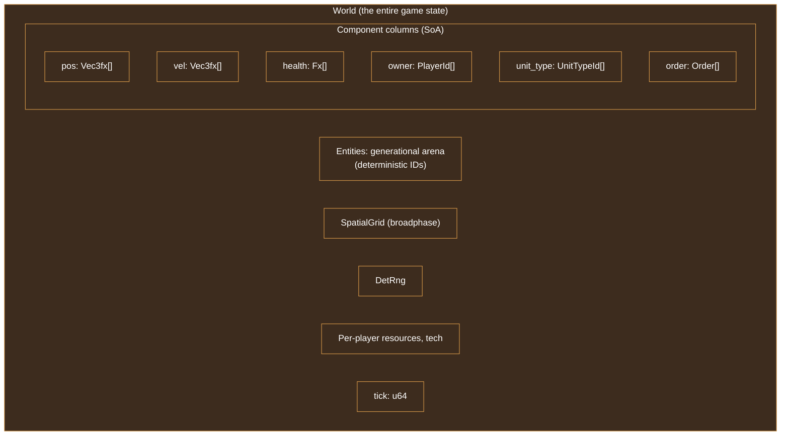
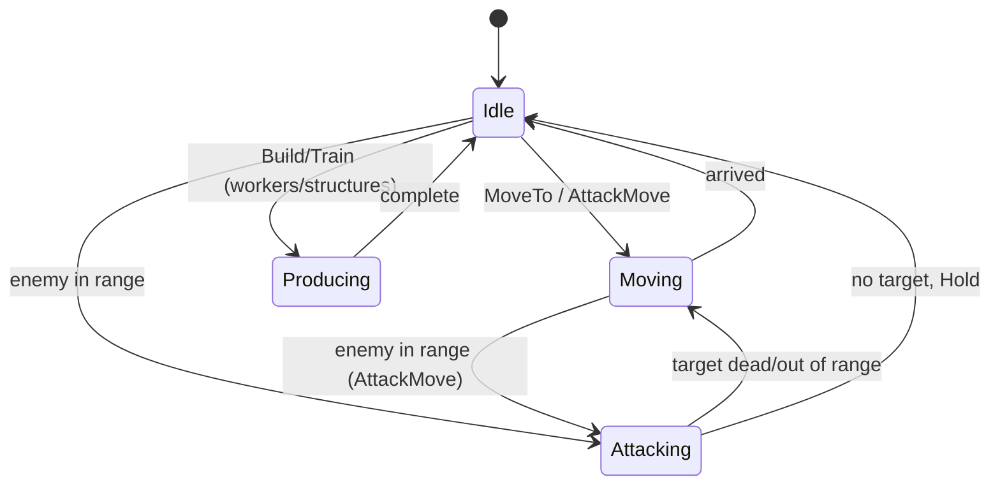
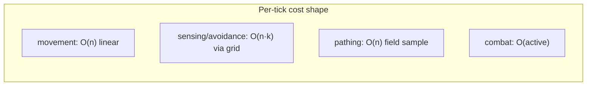

# 02 - Simulation & Data Model (100s–1000s of units)

[← Back to ARCHITECTURE.md](../ARCHITECTURE.md) · [Prev: Determinism](01-determinism.md) · [Next: Networking](03-networking-lockstep.md)

> The `sim` crate is the deterministic heart from [Ch.01](01-determinism.md). It
> holds all game truth, advances one tick at a time, and must comfortably push
> 1000s of units. This chapter is its data model and execution model.

## 1. Why a custom SoA "ECS," not an off-the-shelf one

We want ECS *ergonomics* (composable components, fast iteration) but with two
hard requirements most ECS libraries don't guarantee:

1. **Deterministic iteration order** (see [Ch.01 §4](01-determinism.md)).
2. **No floats / full control over storage layout** for fixed-point SoA.

So `sim` ships a small, purpose-built **Structure-of-Arrays (SoA)** store. It's
~a few hundred lines, gives cache-friendly iteration, and we control every byte.
(`hecs` is fine for the *render* scene graph, where determinism is irrelevant.)



## 2. Entities & components

- **Entity** = a generational index (`{ index: u32, generation: u32 }`). The
  generation guards against stale references when a slot is reused. IDs are
  allocated from a **deterministic free list** (a `Vec<u32>` stack), never from
  pointer addresses.
- **Components** are stored in parallel arrays (columns). Hot components
  (position, velocity, health, order) are dense; rare components live in sparse
  side tables keyed by `EntityId` (lookup, never sim-iterated unordered).
- **Archetype-lite**: rather than full archetype graphs, use a small fixed set of
  component columns plus a per-entity bitmask of which it has. RTS units are
  fairly homogeneous, so this is simpler and faster than a general ECS.

```rust
// crates/sim/src/world.rs (sketch)
pub struct World {
    pub tick: u64,
    pub rng: DetRng,
    entities: Arena,                 // generational, deterministic alloc
    pub pos:   Column<Vec3fx>,       // dense SoA columns
    pub vel:   Column<Vec3fx>,
    pub health:Column<Fx>,
    pub owner: Column<PlayerId>,
    pub kind:  Column<UnitTypeId>,
    pub order: Column<Order>,
    pub facing:Column<Fx>,
    pub grid:  SpatialGrid,          // broadphase, rebuilt/maintained each tick
    pub players: PlayerStates,       // resources, tech, vision
    // ... buildings, projectiles, etc.
}

impl World {
    pub fn step(&mut self, cmds: &[Command]) {
        apply_commands(self, cmds);   // turn intents into orders
        ai::run(self);                // bots emit more commands/orders (Ch.09)
        systems::production(self);    // economy, build queues
        systems::sensing(self);       // target acquisition (uses grid)
        systems::pathing(self);       // flow-field sampling (Ch.07)
        systems::movement(self);      // integrate velocity (fixed-point)
        systems::avoidance(self);     // ORCA local avoidance (Ch.07)
        systems::combat(self);        // damage, projectiles
        systems::death(self);         // resolve deaths, free entities
        self.grid.rebuild(self);      // maintain broadphase
        self.tick += 1;
    }
}
```

> The system list is the **static schedule** from [Ch.01 §4](01-determinism.md).
> Its order is part of the game's definition.

## 3. Static unit data vs per-entity state

Split *what a Marine is* (shared, immutable) from *this Marine's* mutable state.

- **`UnitType`** (data-driven, loaded from RON/JSON at startup, identical on all
  peers): max HP, speed, damage, range, build cost, collision radius, weapon
  profile, model/animation handles. Referenced by `UnitTypeId` (a small int).
- **Per-entity columns** hold only the mutable bits: current HP, position,
  velocity, order, cooldowns.

This keeps columns tiny (cache-friendly for 1000s of units) and makes balance
changes data edits, not code. The data tables are content and **hashed into the
game-start config** so peers can't silently disagree about what a Marine is.

## 4. Spatial partitioning (the key to scale)

Naively, "every unit checks every other unit" for targeting and avoidance is
O(n²) - 1000 units = 1,000,000 checks per tick. Unacceptable. A **uniform
spatial grid** (hash grid) reduces neighbor queries to O(units × local density):

- Cell size ≈ the largest common query radius (e.g. attack range / avoidance
  radius). Units bucket into cells by fixed-point position.
- Queries ("who's within R of P?") visit only the 3×3 (or 3×3×3) neighboring
  cells.
- **Deterministic**: results are gathered then **sorted by `EntityId`** before
  use (see [Ch.01 §4](01-determinism.md)).
- For very large / sparse maps, a loose grid or a fixed-depth quadtree/octree is
  an alternative; a flat hash grid is simplest and fastest for typical RTS
  densities. On **spherical** maps the grid is built on the geodesic surface (see
  [Ch.07](07-pathfinding-navigation.md)).

The same grid serves targeting, collision avoidance, splash damage, vision/fog,
and "select units in box."

## 5. Orders & the unit state machine

A **Command** (networked, from a player/AI) is translated by `apply_commands`
into an **Order** stored on the unit (e.g. `MoveTo(dest)`, `Attack(target)`,
`AttackMove(dest)`, `Hold`, `Build(type, site)`, `Gather(node)`). Each tick a
small state machine advances the order:



Order queues (shift-click waypoints) are a `Vec<Order>` per unit, consumed in
order. All of this is fixed-point and deterministic.

## 6. Performance budget for 1000s of units

Target: a **full sim tick well under the tick budget** (at 25 Hz that's 40 ms,
but we want it in single-digit ms to leave headroom and allow catch-up). Levers:

- **SoA + tight loops**: iterate columns linearly; the CPU prefetcher loves it.
- **Spatial grid** kills O(n²) (§4).
- **Flow fields** make pathing O(1) per unit (sample the field), not per-unit A*
  ([Ch.07](07-pathfinding-navigation.md)).
- **Sleep idle units**: units with `Idle` order and no nearby enemies skip most
  systems until something changes (event/dirty flags).
- **Fixed-point is integer math** - fast and branch-predictable.
- **Deterministic parallelism** (double-buffered columns, `rayon` with fixed-order
  merges) *after* the single-threaded version is proven - see
  [Ch.01 §7](01-determinism.md).



## 7. Snapshots for rendering (crossing the wall, read-only)

The renderer needs to draw smoothly at 144 FPS between 25 Hz ticks. The sim
exposes a **read-only snapshot** of the columns the renderer needs (position,
facing, anim state, team, type). Two snapshots - `prev` and `curr` - are kept;
the renderer interpolates ([ARCHITECTURE.md §4](../ARCHITECTURE.md)).

- The snapshot is a **copy or a frozen view**; rendering must not mutate it.
- Convert fixed-point → `f32` *here*, at the wall, exactly once per visible unit
  per frame. This is the only place that conversion is allowed.
- Snapshots can be produced cheaply by keeping the previous tick's relevant
  columns (or a delta) around.

## 8. Save games & headless mode

Because the World is plain data with no I/O, two freebies fall out:

- **Save/load** = serialize the World (deterministic, via `serde`/`rkyv`). Loading
  resumes an identical sim.
- **Headless mode** = run `World::step` in a loop with no renderer. This powers
  bot-vs-bot testing, determinism CI, and AI training
  ([Ch.09](09-ai-bots.md), [Ch.10](10-roadmap-testing.md)).

> A "save" and a "replay" are different: a save is a *state*; a replay is a *seed
> + command log* ([Ch.03 §6](03-networking-lockstep.md)). Determinism makes both
> trivial.
