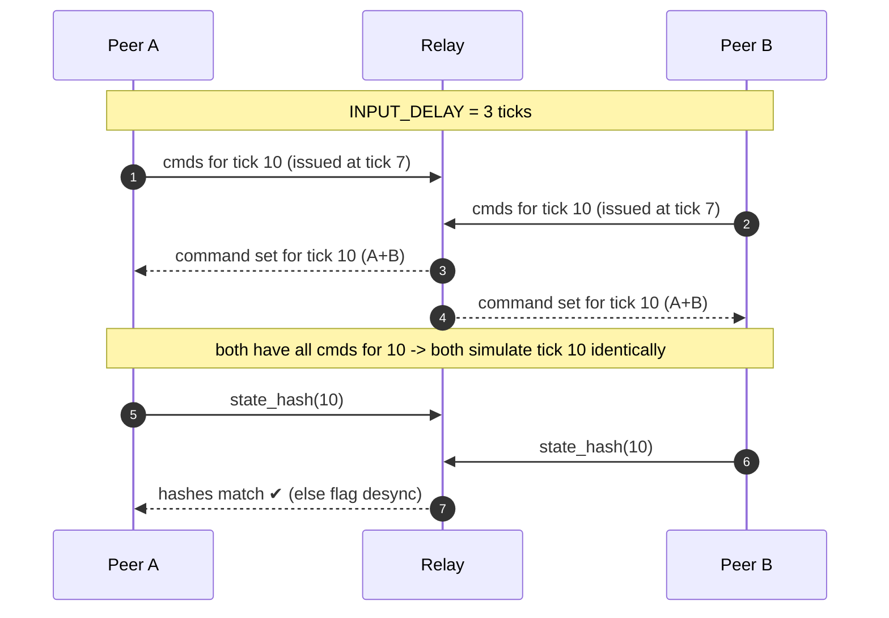
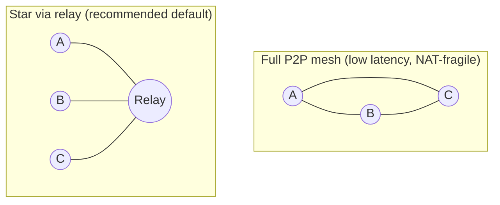
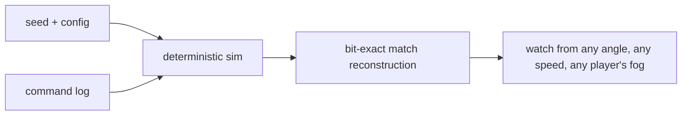

# 03 - Networking & Lockstep Multiplayer

[← Back to ARCHITECTURE.md](../ARCHITECTURE.md) · [Prev: Simulation](02-simulation.md) · [Next: Rendering](04-rendering-wgpu.md)

> Brief: *"multiplayer (WebRTC/ws? peer to peer with server assist)."* This chapter
> answers it: **deterministic lockstep**, commands-only over **WebRTC data
> channels**, coordinated by a lightweight **relay server** (server-assist), with
> peer-to-peer as an optimization. Everything here depends on
> [Ch.01 Determinism](01-determinism.md).

## 1. Why lockstep (and why not rollback)

Because the sim is deterministic ([Ch.01](01-determinism.md)), we send **only the
commands players issue**, not unit state. The bandwidth math is decisive:

| Approach | Per-player bandwidth with 1000 units |
|---|---|
| State sync (send unit positions) | ~hundreds of KB/s up & down - infeasible |
| **Lockstep (send commands)** | a few **bytes** per command, a few commands/sec - trivial |

Two deterministic netcodes exist:

- **Deterministic lockstep + input delay** (StarCraft, AoE, SupCom): wait for all
  peers' commands for a tick, then everyone simulates it. Hide latency by
  scheduling commands a few ticks ahead.
- **Rollback (GGPO)**: predict remote input, simulate ahead, *roll back and
  re-simulate* when prediction was wrong.

**We choose lockstep + input delay.** Rollback is brilliant for fighting games
(2 players, tiny state) but wrong here: rolling back means re-simulating **1000s
of units across several ticks every time a prediction misses** - far too
expensive at RTS scale, and our state is huge to snapshot per frame. Lockstep's
only downside - input latency - is hidden by input delay and is acceptable for
RTS (you're commanding armies, not frame-counting parries).

> This is **Open Decision #3** in [ARCHITECTURE.md §8](../ARCHITECTURE.md). The
> design below assumes lockstep.

## 2. The lockstep turn model

Time is divided into **ticks** ([Ch.00 glossary](00-overview.md)). Commands issued
during tick *T* are tagged to **execute at tick `T + INPUT_DELAY`**. A peer may
simulate tick *T* only once it holds *every* peer's command set for *T* (possibly
empty - "I did nothing this tick" is itself a message).



- **INPUT_DELAY** (e.g. 2–4 ticks) is the cushion that lets remote commands
  arrive before they're needed. Bigger delay = more lag tolerance but more
  perceived input lag.
- **Adaptive latency** (StarCraft-style): measure RTT and grow/shrink the delay
  (and/or tick length) so the cushion matches real network conditions.
- **Empty turns are explicit.** Silence is ambiguous; "no commands for tick T" is
  a message so peers can advance.

```rust
// crates/net - the lockstep gate the game loop calls (ARCHITECTURE.md §4).
pub trait Lockstep {
    fn submit_local(&mut self, exec_tick: u64, cmds: Vec<Command>);
    fn commands_ready(&self, tick: u64) -> bool;       // have all peers' cmds?
    fn commands_for(&mut self, tick: u64) -> CommandSet;
    fn report_checksum(&mut self, tick: u64, hash: u64);
}
```

## 3. Handling latency, stalls & disconnects

- **Stall**: if a peer's commands for the next tick haven't arrived, the sim
  **cannot advance** - that's the lockstep contract. The loop renders the last
  good state and shows the classic *"Waiting for players…"* overlay (rendering
  keeps running because it's on a separate clock - [ARCHITECTURE.md §4](../ARCHITECTURE.md)).
- **Lag spikes**: input delay absorbs small ones; adaptive delay handles
  sustained latency without permanent input lag.
- **Drop**: after a timeout, the relay declares a peer dropped, the remaining
  peers agree (the relay arbitrates), and the sim continues without them (their
  units idle / go to an AI takeover - see [Ch.09](09-ai-bots.md)).
- **Reconnect / late join**: ship a **state snapshot** ([Ch.02 §8](02-simulation.md))
  to the rejoining/observing client, then stream subsequent commands. Pure
  command replay from tick 0 also works for observers but is slow for long games.

## 4. Transport: WebRTC, WebSocket, QUIC

The brief asks "WebRTC/ws?". Here's the call and the reasoning.

| Transport | Reliable/ordered? | NAT traversal | Browser | Native | Use |
|---|---|---|---|---|---|
| **WebRTC DataChannel** | configurable; we use **reliable+ordered** | yes (ICE/STUN/TURN) | ✔ | ✔ (`str0m`/`webrtc`) | **Primary command transport** |
| WebSocket (TCP) | reliable+ordered (TCP) | n/a (client→server) | ✔ | ✔ | **Signaling**; fallback transport |
| QUIC (`quinn`) | reliable streams + datagrams | needs server | ✘ (no raw UDP in browser) | ✔ | **Native-only** alternative |

**Decision:**

- **Command stream → WebRTC DataChannel in reliable-ordered mode.** Lockstep
  *requires* commands to arrive reliably and in order (a lost command desyncs
  everyone), so we don't use unreliable mode for commands. WebRTC works in the
  **browser and natively** (via [`str0m`](https://docs.rs/str0m), a sans-IO WebRTC
  impl, or `webrtc`), giving us one transport everywhere - directly answering
  "WebRTC/ws?".
- **Signaling → WebSocket** to the relay (SDP/ICE exchange to establish WebRTC).
- **QUIC** is offered as a native-only fast path if web support is dropped
  (Open Decision #2, [ARCHITECTURE.md §8](../ARCHITECTURE.md)).
- Commands are tiny, so head-of-line blocking on the reliable channel is a
  non-issue at our message rate.

## 5. Topology: peer-to-peer with server assist

The brief's "peer to peer with server assist" maps to a **relay/coordinator**
model. Three topologies, with the recommendation:



**Recommended: relay (star) by default, P2P mesh as an optimization.** The
**relay** (`apps/relay`, tokio):

1. **Signaling & matchmaking**: lobbies, then brokers WebRTC connections.
2. **TURN fallback**: relays media when direct P2P fails behind strict NATs.
3. **Command coordination ("server assist")**: collects each peer's per-tick
   commands, broadcasts the merged set, and provides a **single ordering
   authority** - every peer sees commands in the same order, which removes a
   whole class of ordering desyncs.
4. **Desync arbitration**: collects `state_hash(T)` from peers, flags the odd one
   out, triggers state dumps ([Ch.01 §6](01-determinism.md)).
5. **Drop arbitration & late-join snapshots** (§3).

Crucially, the relay does **not** run the simulation - every peer does. It's
cheap to host (just shuffles small messages) and sidesteps P2P's NAT and
trust-ordering headaches. When a direct P2P path is available and lower latency,
peers may exchange commands directly and use the relay only for hashing/arbitration.

> **Anti-cheat note:** lockstep means every client has full game state, so
> "maphack"-style information cheats are a known limitation of the genre (the
> client *has* the data; fog of war is enforced client-side). The relay's hash
> arbitration catches *modified-sim* cheats (they desync). Server-authoritative
> simulation would prevent info cheats but throws away the bandwidth win that
> makes 1000s of units possible - not worth it here.

## 6. Replays & spectating (free from determinism)

A replay is just the **map seed + start config + the full command log**. Re-feed
it to the deterministic sim and the entire match reconstructs exactly - perfectly,
in a tiny file.



- **Recording** (`crates/replay`): persist start config + every executed
  `CommandSet`. Negligible size.
- **Playback**: run the sim from the log; the renderer attaches to its snapshots.
  Free camera, variable speed, pause - because you're re-simulating, not playing
  a video.
- **Spectators** are observers who receive the command stream (and an initial
  snapshot to skip the replay-from-zero wait, §3).
- **Version safety**: a replay is only valid for the sim version that produced it.
  Stamp replays with a **sim-version + content hash**; refuse mismatches (a
  changed Marine, hasher, or system order breaks determinism - [Ch.01](01-determinism.md)).

## 7. Protocol & versioning (`crates/protocol`)

- **`Command`** is a compact, versioned enum (`MoveUnits { ids, dest }`,
  `Attack { ids, target }`, `Build { kind, site }`, `SetRally`, …). Encoded with
  `serde` + `bincode`. Unit references are `EntityId`s, not positions.
- **`Message`** wraps commands with `{ exec_tick, player_id, seq }` plus control
  messages (`Hash`, `Ack`, `PlayerDropped`, `Snapshot`).
- **Versioning**: protocol and sim share a version number. On connect, peers
  exchange `{ protocol_version, sim_version, content_hash }` and refuse to start
  if any differ - divergent rules would desync immediately.
- **Bandwidth**: even with all players spamming commands, this is a few KB/s.
  Unit count is irrelevant to bandwidth - *that's the whole point of lockstep.*

## 8. Build order (so multiplayer is testable early)

1. **Loopback lockstep**: one process, one "peer," sim driven through the
   `Lockstep` trait. Proves the game-loop gate.
2. **Two peers, same machine**, over real WebRTC via a local relay. Proves
   transport + coordination.
3. **Determinism gate**: exchange hashes; deliberately introduce a float to watch
   the desync detector fire ([Ch.01 §6](01-determinism.md)).
4. **Latency/loss simulation**: inject artificial RTT/jitter; tune INPUT_DELAY and
   adaptive latency.
5. **Drop/reconnect**, then **replays**, then **spectating**.

See the [roadmap](10-roadmap-testing.md) for where this sits among the other
milestones.
