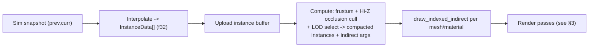
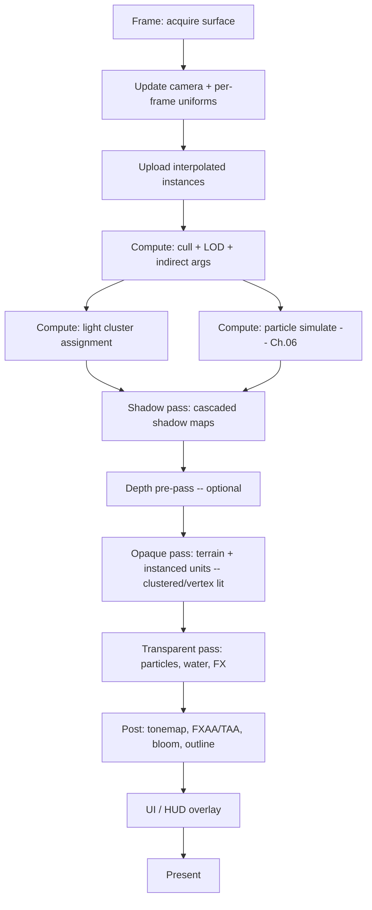

# 04 - Rendering with wgpu (3D models, shaders, lighting, scale)

[← Back to ARCHITECTURE.md](../ARCHITECTURE.md) · [Prev: Networking](03-networking-lockstep.md) · [Next: Animation](05-animation.md)

> Brief: *3D models, shaders, lots of vertex lighting, 100s–1000s of units,
> 120–160 FPS.* The renderer is pure **presentation** ([ARCHITECTURE.md §1](../ARCHITECTURE.md)):
> it reads interpolated snapshots from the sim, uses `f32`/`glam` freely, and
> never writes back. wgpu gives us Vulkan/Metal/DX12/WebGPU from one WGSL codebase.

## 1. The performance equation

1000 units × 144 FPS is **144,000 unit-draws/sec** if done naively - impossible
with one draw call per unit (CPU-bound on draw-call overhead long before that).
Two techniques make it trivially affordable, and the whole renderer is built
around them:

1. **GPU instancing** - one draw call renders *all* units sharing a mesh; per-unit
   data (transform, team color, animation cursor) lives in a buffer indexed by
   instance ID.
2. **GPU-driven culling + indirect draws** - a compute shader culls instances
   (frustum + occlusion) and writes the surviving instance list and the
   `draw_indirect` arguments. The CPU's per-frame cost becomes nearly
   **independent of unit count**.



## 2. Renderer structure (`crates/render`)

A small **render graph** of passes with explicit resource (texture/buffer)
dependencies, recorded into wgpu command encoders. No global mutable GPU state;
each pass declares what it reads and writes. This keeps passes reorderable and
makes adding effects (shadows, bloom) local changes.



Core abstractions: `Renderer` (device/queue/surface), `RenderGraph`
(passes + resources), `MeshRegistry` (vertex/index buffers, shared per mesh),
`MaterialRegistry` (pipelines + bind groups), `InstanceBuffers` (per mesh-type
instance arrays), `Camera` (RTS pan/rotate/zoom, ortho or perspective).

## 3. 3D models & assets

- **glTF 2.0** is the pipeline format (via the `gltf` crate): meshes, materials,
  skeletons, animations, scenes. Tools (Blender) export it natively.
- At load, geometry is converted to our packed vertex layout and uploaded once;
  meshes are shared and referenced by `MeshId`. Textures via `image`, batched into
  **texture arrays / atlases** so many unit types share a pipeline (fewer bind
  group switches).
- For fastest startup we bake glTF → an internal `rkyv` asset
  ([Ch.10](10-roadmap-testing.md)) for zero-copy loads.
- Vertex layout (typical): position, normal, tangent, uv, and (for skinned
  meshes) joint indices + weights ([Ch.05](05-animation.md)).

## 4. Lighting - "lots of vertex lighting"

The brief's emphasis on **vertex lighting** shapes the lighting model, and it's
also the cheapest route to 1000s of lit units at 144 FPS. Two complementary
pieces:

### (a) Vertex-evaluated lighting for units

Lighting is computed in the **vertex shader** (Gouraud-style) and interpolated
across the triangle, instead of per-pixel. For low-poly/stylized RTS units this
looks great and costs a fraction of per-pixel shading - exactly the budget we
want when there are thousands of them on screen.

### (b) Clustered forward shading for *many* dynamic lights

"Lots of lighting" also implies many **dynamic** lights - muzzle flashes,
explosions, projectiles, unit glows, ability effects. Naive forward shading is
O(objects × lights); we use **clustered forward+**:

- Divide the view frustum into a 3D grid of **clusters** ("froxels").
- A **compute shader** assigns each light to the clusters it touches (per frame).
- When shading a vertex/fragment, look up only the lights in *its* cluster - cost
  scales with *local* light density, not total light count. Hundreds–thousands of
  dynamic lights become affordable.


This pairs naturally with (a): evaluate the clustered lights **per vertex** for
units (cheap, "lots of lights" satisfied), and optionally per-pixel for terrain
and hero/closeup units where it matters. Deferred shading is the usual answer for
many lights but conflicts with the *vertex-lighting* aesthetic and with cheap MSAA
at high FPS, so **clustered forward is the recommended default**.

### Shadows

- **Cascaded Shadow Maps (CSM)** for the single sun/directional light (the one
  shadow that reads as "real" in a top-down RTS). 2–4 cascades.
- Point/spot dynamic lights are **unshadowed** by default (shadow-mapping hundreds
  of them is unaffordable and barely visible in motion). A few "important" lights
  can opt into shadows if needed.

## 5. Shaders (WGSL)

- All shaders are **WGSL**, compiled by wgpu/naga; one source for native + web.
- A small **shader library** of WGSL includes (camera/frame uniforms, the
  clustered-light lookup, skinning/VAT sampling, fog, color-grading) shared across
  pipelines via string composition or naga modules.
- Key pipelines: terrain, instanced-unit (vertex-lit + clustered), skinned/VAT
  unit ([Ch.05](05-animation.md)), particle ([Ch.06](06-particles.md)), shadow,
  post-process, UI.
- A **hot-reload** path (watch + recompile WGSL) for fast iteration in dev builds.

```wgsl
// Sketch: instanced unit vertex shader doing vertex lighting + cluster lookup.
struct Instance { model: mat4x4<f32>, team_color: vec4<f32>, anim: vec2<f32> };
@group(1) @binding(0) var<storage> instances: array<Instance>;

@vertex
fn vs_main(v: VertexIn, @builtin(instance_index) i: u32) -> VsOut {
    let inst = instances[i];
    let world = inst.model * vec4<f32>(v.pos, 1.0);
    let n = normalize((inst.model * vec4<f32>(v.normal, 0.0)).xyz);
    // Sun term + clustered dynamic lights, evaluated PER VERTEX:
    var lit = sun_lambert(n) ;
    let cluster = cluster_index(world.xyz, frame.view, frame.proj);
    for (var k = 0u; k < cluster_light_count(cluster); k++) {
        lit += point_light_contrib(cluster_light(cluster, k), world.xyz, n);
    }
    var o: VsOut;
    o.clip = frame.view_proj * world;
    o.color = vec4<f32>(lit, 1.0) * inst.team_color;   // interpolated to fragments
    return o;
}
```

## 6. Hitting 120–160 FPS at scale - the toolbox

- **GPU instancing + indirect draws + GPU culling** (§1) - the headline.
- **LOD**: instances pick a mesh LOD by distance in the cull compute pass; far
  units use low-poly meshes, very far ones use **billboard imposters**.
- **Vertex lighting** (§4a) - fewer per-pixel ops.
- **Clustered lights** (§4b) - light cost scales with locality, not count.
- **Texture arrays / atlases + bindless-style indexing** - minimize pipeline and
  bind-group switches; batch many unit types into few draws.
- **Animation via baked bone textures** so animating 1000s of units adds no CPU
  cost ([Ch.05](05-animation.md)).
- **Hi-Z occlusion culling** - units behind terrain/structures cost nothing.
- **Frame pacing**: present mode chosen for the target - `Immediate`/`Mailbox`
  for uncapped high FPS, `Fifo` (vsync) when desired. Triple buffering.
- **Async asset upload** on a transfer queue; never stall the frame on I/O.
- **Profile relentlessly** with Tracy ([Ch.10](10-roadmap-testing.md)); the budget
  at 144 FPS is ~6.9 ms/frame - measure, don't guess.

## 7. The wall, restated (it matters here)

The renderer **only reads** the two latest sim snapshots and interpolates with
`alpha` ([ARCHITECTURE.md §4](../ARCHITECTURE.md)):

- Positions/facings: lerp / `slerp` between `prev` and `curr` (`f32`, fine).
- Anything the renderer computes - interpolation, culling, particle motion,
  animation phase, camera - is **presentation-only** and never flows back into the
  sim ([Ch.01](01-determinism.md)). A dropped frame or a different GPU changes
  *only what you see*, never the game.

## 8. Camera & picking (RTS specifics)

- **Camera**: edge/RTS pan, rotate, zoom; perspective with a high pitch, or
  orthographic for a classic look. On **spherical** maps the camera orbits the
  planet ([Ch.07](07-pathfinding-navigation.md), [Ch.08](08-procedural-generation.md)).
- **Selection/picking**: prefer a **GPU ID pass** (render entity IDs to an offscreen
  target; read back the pixel under the cursor / box) over CPU raycasts - it's
  exact at 1000-unit density and cheap. The *result* (which units are selected)
  becomes a player intent and only matters when it produces a **Command**, which
  is where it (deterministically) crosses back into the sim
  ([Ch.03 §7](03-networking-lockstep.md)).
