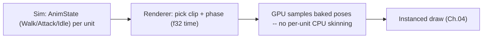
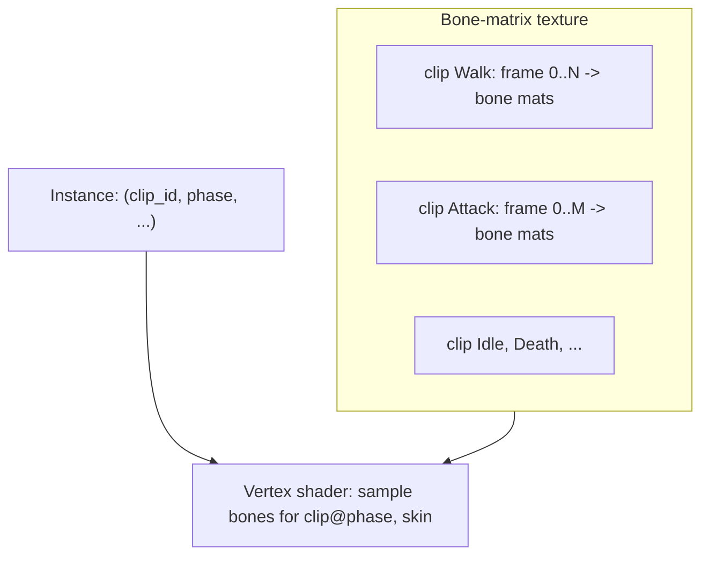

# 05 — Animation (at crowd scale)

[← Back to ARCHITECTURE.md](../../ARCHITECTURE.md) · [Prev: Rendering](04-rendering-wgpu.md) · [Next: Particles](06-particles.md)

> Brief: *animations.* The challenge is animating **1000s of units** at 144 FPS.
> Animation is **presentation-only** ([Ch.01](01-determinism.md)): the sim says
> *"this unit is walking"* (a discrete `AnimState`); the renderer decides exactly
> which skeletal pose to show. Animation never affects the sim.

## 1. The scaling problem

Classic skeletal animation does, per unit per frame: sample animation curves →
compute ~30–80 bone matrices → skin the mesh. On the **CPU**, that's hopeless for
thousands of units. So the rule is: **make per-unit animation cost independent of
unit count** by precomputing poses and doing the work on the GPU.



## 2. Recommended: baked bone-matrix textures (animation atlas)

Bake every animation clip, at a fixed sample rate, into a **GPU texture/buffer of
bone matrices**: rows = animation frames, columns = bones. At runtime each
instance carries `(clip_id, phase)`; the vertex shader looks up the bone matrices
for that clip+frame and skins on the GPU.

- **Cost is O(1) CPU per unit** — just write `(clip, phase)` into the instance
  buffer ([Ch.04 §1](04-rendering-wgpu.md)). Animating 1000 units costs the same
  per-unit as animating one.
- Works perfectly with **GPU instancing + indirect draws** — this is the standard
  "crowd animation" technique (a.k.a. animation/bone textures; VAT is the
  vertex-position variant).
- **Trade-off**: discrete baked frames and **limited runtime blending** between
  clips (you can cross-fade two sampled poses, but it's not full skeletal blend
  trees). For an RTS where units are small on screen, this is invisible and the
  right trade.



```wgsl
// Sketch: GPU skinning by sampling the baked bone texture.
@group(2) @binding(0) var bone_tex: texture_2d<f32>;     // rows: clip frames, cols: bones*3 (mat4x3)
fn bone_matrix(clip_base: u32, frame: u32, joint: u32) -> mat4x4<f32> { /* texelFetch 3 rows */ }

@vertex
fn vs_skinned(v: SkinIn, @builtin(instance_index) i: u32) -> VsOut {
    let inst = instances[i];                              // (clip_base, frame, blend...)
    var skinned = vec4<f32>(0.0);
    for (var j = 0u; j < 4u; j++) {                       // 4 weights/vertex
        let m = bone_matrix(inst.clip_base, inst.frame, v.joints[j]);
        skinned += v.weights[j] * (m * vec4<f32>(v.pos, 1.0));
    }
    // ... then vertex lighting + clustering exactly as in Ch.04 ...
}
```

## 3. Hero / closeup path: real-time GPU skinning

For the handful of units that are ever shown large (campaign heroes, cinematics,
zoomed-in detail), use **conventional GPU vertex skinning**: sample glTF animation
curves on the CPU for *just those units*, upload a small bone-matrix palette, skin
in the shader with full blend trees. Few units → cost is fine.

> A **policy in the render layer** chooses per unit: baked atlas for the masses,
> real skinning when on-screen size exceeds a threshold. Same mesh, two paths.

## 4. Driving animation from sim state

- The sim stores a tiny, discrete **`AnimState`** per unit (`Idle`, `Walk`,
  `Attack`, `Cast`, `Death`, …) — set by the order/state machine
  ([Ch.02 §5](02-simulation.md)). It's fixed-point/enum and part of determinism
  only insofar as it's derived from sim logic; the *visual* it maps to is not.
- The renderer maps `AnimState → clip` and advances **`phase`** using the
  **presentation clock** (`f32` time), with cosmetic per-unit phase offsets (from
  the presentation RNG, [Ch.01 §3](01-determinism.md)) so a formation doesn't
  march in lockstep-looking unison.
- **Event-synced animation**: when combat fires on tick *T*
  ([Ch.02](02-simulation.md)), the sim emits a one-shot presentation event
  ("unit X attacked") the renderer uses to trigger the attack clip and a muzzle
  particle/light ([Ch.06](06-particles.md)) — keeping visuals in step with the
  authoritative sim without the sim knowing about animation.

## 5. Transitions & polish (cheap wins)

- **Cross-fade** between consecutive clips by blending two sampled poses over a
  short window — enough to kill popping, cheap even at scale.
- **Death → ragdoll/disintegrate**: a death is a sim event; the corpse is a
  presentation-only entity (it can use floats/particles and is reaped on the
  render side).
- **Procedural touches** (turret yaw tracking the target, recoil, lean into
  turns) computed in the renderer from snapshot data — never fed back.

## 6. Why not CPU skinning or per-unit GPU palettes?

| Approach | Per-unit CPU cost | Blending | Verdict |
|---|---|---|---|
| CPU skinning | high (curves + matrices) | full | ✘ dies at hundreds of units |
| Per-unit GPU bone palette | medium (CPU samples curves) | full | ✘ CPU curve sampling still scales with units |
| **Baked bone texture (atlas)** | ~zero | limited | ✔ **default for the masses** |
| Real-time GPU skinning | low, but only viable for few | full | ✔ **heroes/closeups only** |

The mix in §2–§3 gives crowd scale *and* fidelity where it's seen.
