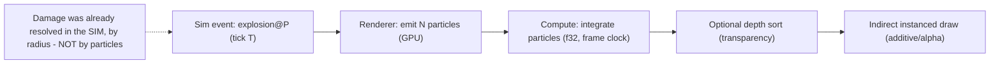
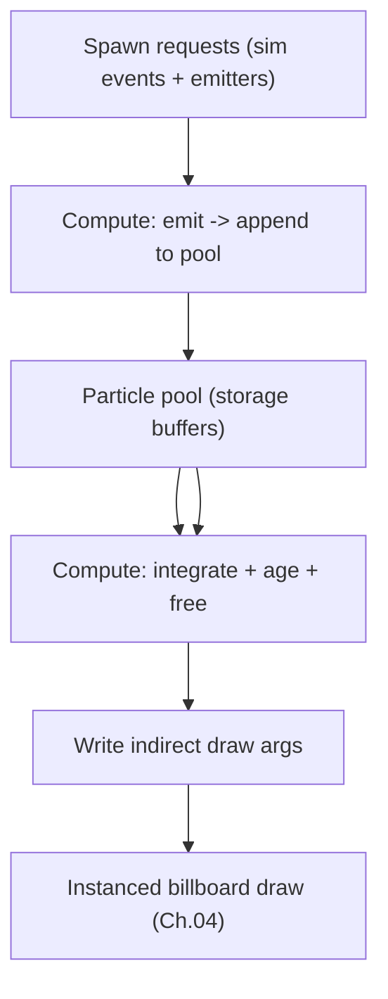

# 06 - Particles (GPU-driven, cosmetic)

[← Back to ARCHITECTURE.md](../ARCHITECTURE.md) · [Prev: Animation](05-animation.md) · [Next: Pathfinding](07-pathfinding-navigation.md)

> Brief: *particles.* Explosions, muzzle flashes, smoke, dust, ability VFX, weather.
> **Particles are 100% presentation** ([Ch.01](01-determinism.md)) - they run on
> the GPU with `f32`, may differ machine-to-machine, and **must never affect the
> simulation.** This isolation is what lets them be cheap and plentiful.

## 1. Why particles live entirely outside the sim

If particles influenced gameplay, every machine would have to simulate millions
of them identically in fixed-point - absurd. Instead:

- The **sim** decides *what happened*: "explosion at P on tick T", "unit firing".
  That's a deterministic **presentation event** ([Ch.05 §4](05-animation.md)).
- The **renderer** spawns and simulates the actual particles however it likes -
  GPU, floats, frame-rate-dependent - because none of it feeds back.

> **Gameplay rule:** splash damage, vision, etc. are computed in the sim by
> radius/area ([Ch.02 §4](02-simulation.md)). The particle burst is just the
> *picture* of it.

## 2. GPU-driven particle system

To reach the "lots of particles" bar (hundreds of thousands–millions), the whole
lifecycle lives on the GPU:

- **State in storage buffers**: position, velocity, life, size, color per particle
  (`f32`). No CPU per-particle work.
- **Emission**: a compute pass consumes spawn requests (from sim events + ambient
  emitters) and appends new particles to a free list.
- **Simulation**: a compute pass integrates motion, gravity, drag, fades life,
  and kills dead particles - all on the frame clock.
- **Rendering**: **indirect instanced** draw of camera-facing billboards (or
  ribbons/meshes), using the same instancing/indirect machinery as units
  ([Ch.04 §1](04-rendering-wgpu.md)). The compute pass writes the draw count, so
  the CPU never counts particles.
- **Sorting**: additive blends (fire, energy) need no sort; alpha-blended smoke
  gets an optional GPU depth sort or order-independent transparency if needed.

## 3. Particle effects as data

Effects are **data-driven assets** (`ParticleEffect`: emitter shape, rate, bursts,
lifetime, size/color/velocity-over-life curves, blend mode, texture). A library
(`assets`) maps a logical event → effect:

| Sim event | Effect |
|---|---|
| Weapon fired | muzzle flash + smoke puff + dynamic light ([Ch.04 §4](04-rendering-wgpu.md)) |
| Projectile impact / explosion | debris + fireball + shockwave + light |
| Unit death | gibs / disintegration / dust |
| Construction / harvesting | sparks, dust |
| Ability cast | bespoke VFX |
| Ambient | dust devils, smoke from wrecks, weather |

This keeps VFX in the hands of artists/designers, not code.

## 4. Lighting & integration

- Big bursts (explosions, muzzle flashes) spawn **dynamic lights** that the
  clustered-forward system already handles ([Ch.04 §4b](04-rendering-wgpu.md)) -
  this is a chunk of the "lots of vertex lighting" payoff: transient lights
  everywhere, cheaply.
- Particles render in the **transparent pass** after opaque geometry, reading
  (not writing) the depth buffer for soft/depth-faded particles.

## 5. Determinism & performance guardrails

- **No readback into sim.** The particle buffers are GPU-only; nothing is read
  back to the CPU for gameplay. (Enforced by the wall - `render` can't touch sim
  state, [ARCHITECTURE.md §3](../ARCHITECTURE.md).)
- **Cosmetic RNG only**: jitter uses the presentation RNG, never `DetRng`
  ([Ch.01 §3](01-determinism.md)).
- **Budgeted pools**: a hard cap on live particles with graceful degradation
  (oldest/lowest-priority recycled first) so a 1000-unit melee can't blow the
  frame budget - important for the 120–160 FPS target
  ([Ch.04 §6](04-rendering-wgpu.md)).
- **LOD by distance/importance**: distant or off-screen emitters reduce rate or
  cull entirely (reuse the GPU cull from [Ch.04](04-rendering-wgpu.md)).
