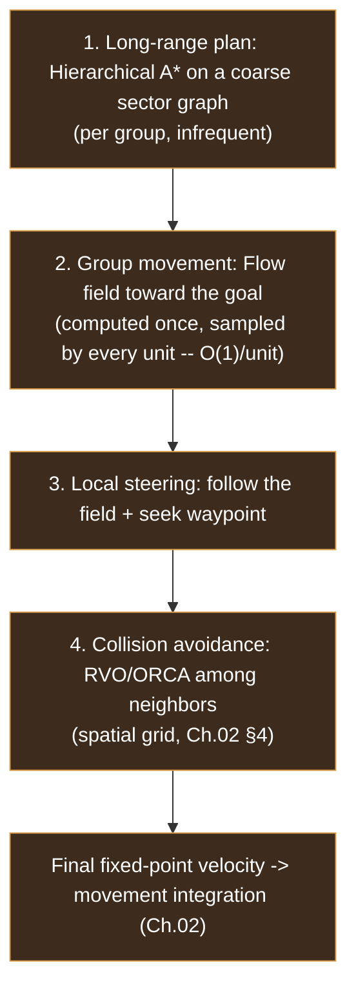
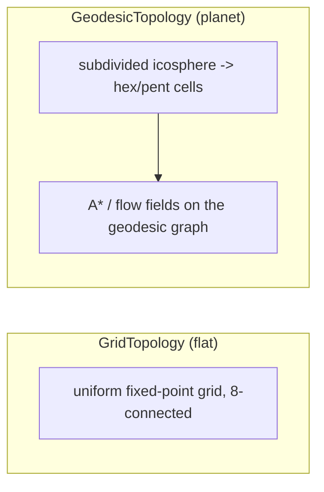
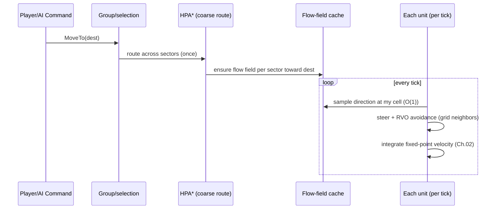

# 07 — Pathfinding, Navigation & Collision Avoidance

[← Back to ARCHITECTURE.md](../../ARCHITECTURE.md) · [Prev: Particles](06-particles.md) · [Next: Worldgen](08-procedural-generation.md)

> Brief: *advanced spherical A*, navmesh navigation, or some way to navigate
> terrain; collision avoidance — for 100s–1000s of units.* This is pure
> **simulation**, so everything here is **fixed-point and deterministic**
> ([Ch.01](01-determinism.md)). The headline: **don't run A* per unit.** Use a
> layered system where the expensive search is shared by whole groups.

## 1. Why per-unit A* fails at scale (and the layered answer)

A* from scratch for each of 1000 units, every time they're ordered to move, is
the classic way to make an RTS chug. Real RTS engines (SupCom, Planetary
Annihilation) use a **hierarchy**:



Each layer handles what it's good at: A* finds the *route*, flow fields make
*following it* free per unit, steering + RVO keep units apart. This is what makes
1000 units pathing feasible inside the tick budget ([Ch.02 §6](02-simulation.md)).

## 2. The terrain abstraction: `Topology` (flat **or** spherical)

The brief says "spherical A*" but "like StarCraft" (flat). We support both behind
one trait so the rest of the sim doesn't care:

```rust
// crates/pathfind — navigation is generic over the world's shape.
pub trait Topology {
    type Cell: Copy + Eq + Ord;                 // Ord => deterministic ordering
    fn neighbors(&self, c: Self::Cell) -> NeighborIter<Self::Cell>;
    fn cost(&self, a: Self::Cell, b: Self::Cell) -> Fx;   // fixed-point
    fn cell_at(&self, p: WorldPos) -> Self::Cell;
    fn passable(&self, c: Self::Cell) -> bool;
    fn direction(&self, from: Self::Cell, to: Self::Cell) -> Vec3fx; // for flow fields
}
```

- **Flat map** → `GridTopology`: a 2D fixed-point grid (4/8-connected), the
  StarCraft default. Cells map directly to the spatial grid
  ([Ch.02 §4](02-simulation.md)).
- **Spherical map** → `GeodesicTopology`: the planet is a **subdivided
  icosahedron** (a *geodesic grid* of mostly-hexagonal cells — the
  Planetary-Annihilation approach). Pathfinding runs on this graph; "spherical A*"
  is just A* over geodesic cells. Movement is constrained to the sphere surface
  (integrate on the local tangent plane, re-project onto the sphere — all in
  fixed-point).



> This is **Open Decision #1** ([ARCHITECTURE.md §8](../../ARCHITECTURE.md)). Flat
> is the default; spherical is a drop-in `Topology`. Because everything above the
> trait is shape-agnostic, choosing later is cheap.

## 3. Layer 1 — Hierarchical long-range A* (HPA*)

Searching a million-cell map per move is too slow even once. So:

- Partition the map into **sectors** (clusters of cells) with precomputed
  **portals** (where adjacent sectors connect) and intra-sector path costs.
- Long-range search runs A* on the small **portal graph** (hundreds of nodes, not
  millions of cells) → a coarse route of sectors/portals.
- Recompute only when blocked or re-ordered; cache results.
- **Determinism**: A* uses fixed-point costs, an ID-ordered open set, and explicit
  tie-breaks ([Ch.01 §4](01-determinism.md)). On a sphere, sectors are patches of
  the geodesic grid.

## 4. Layer 2 — Flow fields (the scale trick)

For a group heading to a goal, compute **one vector field** over the relevant
cells and let *every* unit sample it:

- Run a **Dijkstra/BFS from the goal** over passable cells (integer/fixed-point
  costs) → an **integration field** (distance-to-goal per cell).
- Derive a **flow field**: each cell stores the direction toward the lowest
  neighbor (`Topology::direction`).
- Every unit's "where do I go next" becomes **one cell lookup — O(1) per unit**,
  no per-unit search. 1000 units share the cost of one field.
- Compute fields lazily per (goal, sector) and **cache** them; recompute on
  obstacle changes (a new building, a destroyed bridge).
- Great for the common case of armies converging on a point; pairs with HPA* for
  long distances (flow field per sector along the coarse route).


## 5. Layer 4 — Local collision avoidance

Flow fields route the *group*; units still must not pile up or interpenetrate.
**Reciprocal Velocity Obstacles (RVO/ORCA)**, reimplemented in fixed-point:

- Each unit considers neighbors from the **spatial grid** ([Ch.02 §4](02-simulation.md))
  — neighbors gathered and **sorted by `EntityId`** for determinism.
- Compute a velocity that makes progress along the flow direction while avoiding
  collisions, each unit assuming others share responsibility (reciprocal) → no
  oscillation, smooth crowds.
- For very dense blobs, fall back to simpler **boids-style steering** (separation
  + flow-follow) which is cheaper; RVO for important/expensive units.
- **Unit-vs-static** (buildings, cliffs): the flow field already encodes
  impassability; a short look-ahead prevents corner-cutting.

> All avoidance math is fixed-point and order-stable — a desync here would be as
> fatal as one in combat ([Ch.01](01-determinism.md)).

## 6. Navmesh — the alternative for organic terrain

Grid + flow fields are ideal for RTS-scale crowds. A **navigation mesh** (convex
polygons over walkable surfaces, Recast/Detour-style) is better when terrain is
highly irregular or units are few and large, giving smoother, less "griddy"
paths. The design keeps it as an **alternative `Topology`/cost source**:

- Build the navmesh from terrain at worldgen ([Ch.08](08-procedural-generation.md))
  or load it; rebuild regions on terrain edits.
- A* over polygons + funnel algorithm for taut paths; flow fields can still be
  layered on top for groups.
- **Determinism caveat**: navmesh *generation* often uses floats — so either
  generate it **offline/at load deterministically and quantize to fixed-point**,
  or generate from the shared seed and **hash it** like the map
  ([Ch.08 §5](08-procedural-generation.md)). The *runtime* queries must be
  fixed-point.

**Recommendation:** ship **grid + flow fields** first (simplest path to 1000s of
units, works on flat and sphere); add navmesh later for maps/units that need it.

## 7. Putting it together (per move order)



## 8. Performance & determinism summary

- **Shared search**: A* and flow fields are computed per *group/goal*, not per
  unit; per-unit cost is an O(1) field lookup + local avoidance.
- **Spatial grid** bounds neighbor queries ([Ch.02 §4](02-simulation.md)).
- **Caching**: flow fields and HPA* routes are cached and invalidated on terrain
  change.
- **All fixed-point, all order-stable**: costs, open sets, neighbor lists, and the
  `Topology::Cell: Ord` bound guarantee identical paths on every machine
  ([Ch.01](01-determinism.md)) — so two peers' armies always move identically.
