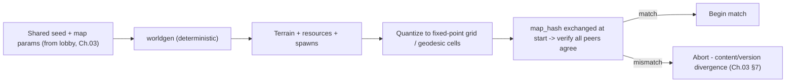
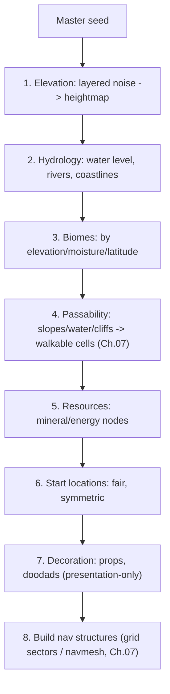

# 08 - Procedural Map Generation (large maps)

[← Back to ARCHITECTURE.md](../ARCHITECTURE.md) · [Prev: Pathfinding](07-pathfinding-navigation.md) · [Next: AI Bots](09-ai-bots.md)

> Brief: *large maps, procedural map generation.* The map is part of the initial
> simulation state, so generation must be **deterministic**: every peer generates
> the **identical** map from a shared **seed** ([Ch.01](01-determinism.md)).
> Generation must also support the **flat or spherical** `Topology`
> ([Ch.07 §2](07-pathfinding-navigation.md)) and scale to large worlds.

> Implemented: a concrete **[world catalog](../worldgen.md)** of 21 Solar System
> battlefields (the Moon, Mars, the major moons, Pluto, Chiron) with per-world
> texture archetypes, procedural terrain recipes and map hazards. Generator +
> previews: [`assets/worldgen/`](../../assets/worldgen/); engine procgen mirror:
> [`apps/client/src/worlds.rs`](../../apps/client/src/worlds.rs).

## 1. The determinism requirement (this is the catch)

Two peers with different terrain desync instantly - a "passable" cliff on one
machine is a wall on another. So map generation is bound by the same rules as the
sim:

Two valid strategies (we use the first, with the second as a safety net):

1. **Seed-based deterministic generation on every peer.** Same seed + same code →
   same map. Cheapest (no map transfer), enables tiny replays ([Ch.03 §6](03-networking-lockstep.md)).
2. **Generate once (e.g. on the relay/host) and distribute** the finished map.
   Heavier bandwidth but immune to generator non-determinism. Good fallback for
   user-made or imported maps.

**Either way, the generated map is hashed and the hash is exchanged at start**
([Ch.03 §7](03-networking-lockstep.md)) so a mismatch is caught before tick 0
rather than as a mid-game desync.

### Floats in generation - handled carefully

Noise functions are naturally floating-point. Two ways to stay safe:

- **Generate with floats, then quantize**: snap heights/passability/resource
  positions to the **fixed-point grid** *before* they enter the sim, and rely on
  the **map hash** to catch any residual divergence. Simple; the quantization step
  is the wall ([Ch.01 §1](01-determinism.md)).
- **Fully deterministic integer/fixed-point generation**: implement noise in
  fixed-point for guaranteed bit-identical output. More work; reserve for if
  quantization ever proves insufficient.

> Worldgen runs **once at startup**, not per tick, so it can even use threads
> (`rayon`) for speed *if* the result is reduced deterministically and quantized.
> The *steady-state* sim never touches this code.

## 2. Generation pipeline

A staged pipeline, each stage seeded from the master seed via a split RNG
([Ch.01 §3](01-determinism.md)) so stages are independent yet reproducible:

1. **Elevation** - fractal/layered noise (Perlin/Simplex/OpenSimplex2 via the
   `noise` crate, or value noise) to a heightmap; domain warping for natural
   shapes.
2. **Hydrology** - sea level, lakes, optional river carving / light erosion.
3. **Biomes** - assign by elevation + moisture (+ latitude on a sphere): grass,
   desert, rock, snow - drives textures and movement cost.
4. **Passability** - slope/water/cliff thresholds mark cells walkable or not,
   feeding the `Topology` ([Ch.07](07-pathfinding-navigation.md)).
5. **Resources** - place economy nodes (StarCraft minerals/gas analog) by rules.
6. **Start locations** - see §4 (fairness).
7. **Decoration** - purely visual props; **presentation-only**, can use floats and
   even differ cosmetically per machine ([Ch.01](01-determinism.md)).
8. **Nav build** - precompute sectors/portals/flow-field scaffolding or navmesh
   ([Ch.07](07-pathfinding-navigation.md)); deterministic + hashed.

## 3. Flat vs spherical generation

- **Flat** (`GridTopology`): sample 2D noise over the grid; edges are world
  borders. Straightforward.
- **Spherical** (`GeodesicTopology`): sample **3D noise on the sphere surface**
  (no seams, no pole distortion) and write per-geodesic-cell values; optionally a
  light **tectonic/plate** pass for continents (the Planetary-Annihilation look).
  Start locations and resources are placed on the geodesic grid. Same pipeline,
  different sampling domain - the staged design above is topology-agnostic.

## 4. Large maps & fairness

- **Scale**: chunk the world so generation and streaming are tractable for large
  maps; generate lazily by region where possible. The 64-bit fixed-point world
  coordinates ([Ch.01 §2](01-determinism.md)) cover large extents without
  overflow.
- **Competitive fairness**: for ranked/symmetrical play, **mirror or rotate** the
  map about its center so every start is equivalent (rotational symmetry for N
  players, reflective for 1v1). Validate that each start has comparable resources
  and a viable path to opponents.
- **Reachability validation**: after generation, a deterministic flood-fill
  confirms all start locations and resources are mutually reachable
  ([Ch.07](07-pathfinding-navigation.md)); if not, perturb the seed and
  regenerate (deterministically) - never ship an unplayable map.

## 5. Verification & tooling

- **`map_hash`** over the quantized terrain + resources + spawns is part of the
  start handshake ([Ch.03 §7](03-networking-lockstep.md)).
- A **headless generator** (in `testkit`/`worldgen`) renders previews and runs the
  reachability/fairness checks in CI for a range of seeds
  ([Ch.10](10-roadmap-testing.md)).
- Because generation is seed-deterministic, **a map is just a seed + params** -
  shareable as a short string, and reproducible forever (same property that makes
  replays tiny, [Ch.03 §6](03-networking-lockstep.md)).
