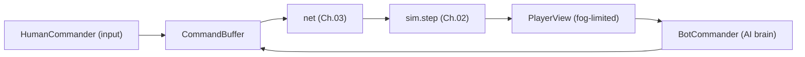
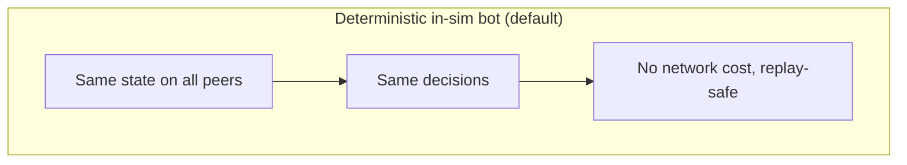
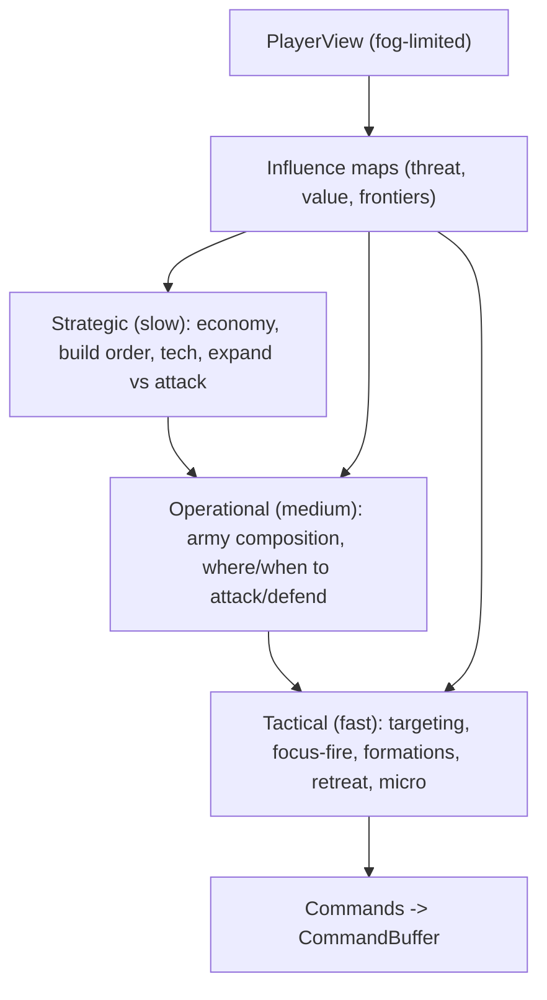
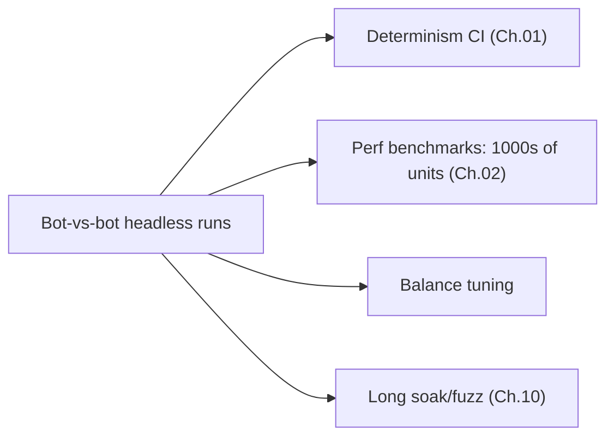

# 09 — AI Bots (built alongside everything)

[← Back to ARCHITECTURE.md](../../ARCHITECTURE.md) · [Prev: Worldgen](08-procedural-generation.md) · [Next: Roadmap](10-roadmap-testing.md)

> Brief: *AI bot support — build this alongside all other features.* The
> architecture makes that natural: **an AI bot is a player.** It produces the same
> `Command`s a human does, through the same API ([Ch.03 §7](03-networking-lockstep.md)).
> Because we build the command pipeline on day one, bots come "for free" and
> become our primary test harness.

## 1. The core idea: AI is a `Commander`

Human input and AI are two implementations of one interface. Nothing downstream
can tell them apart — both just emit commands into the buffer the game loop drains
([ARCHITECTURE.md §4–5](../../ARCHITECTURE.md)).

```rust
// crates/ai — the same seam human input uses (Ch.03 §7).
pub trait Commander {
    /// Read-only view of what THIS player can legally see (fog of war).
    /// Emit zero or more commands for this decision step.
    fn think(&mut self, view: &PlayerView, out: &mut CommandBuffer);
}

pub struct HumanCommander { /* mouse/keyboard -> commands */ }
pub struct BotCommander  { brain: AiBrain, rng: DetRng /* Ch.01 */ }
```



This single decision is why "build AI alongside everything" is cheap: the command
seam exists from [Milestone 2](10-roadmap-testing.md), and the bot just plugs in.

## 2. Deterministic in-sim bots (the default)

The recommended default: bots run **inside the deterministic simulation**, in
fixed-point with the in-state `DetRng` ([Ch.01](01-determinism.md)). Consequences,
all good:

- **Zero network cost.** Every peer computes the *same* bot decisions from the
  *same* state — so bot commands need **not** be sent over the wire. A 7-bot melee
  adds no bandwidth ([Ch.03 §1](03-networking-lockstep.md)).
- **Replay-safe.** Bots reproduce exactly in replays (they're part of the
  deterministic sim, [Ch.03 §6](03-networking-lockstep.md)).
- **Trivially testable.** Headless bot-vs-bot runs are deterministic and fast
  ([Ch.10](10-roadmap-testing.md)).

The cost: the bot brain must obey determinism (no floats, no `HashMap` iteration,
no wall clock — [Ch.01 §9](01-determinism.md)). For classic RTS AI (utility/HTN/
behavior trees over fixed-point heuristics) this is entirely doable.



## 3. Networked / heavy AI (the escape hatch)

Some AI can't or shouldn't be deterministic — e.g. a neural-net policy, or an
experimental brain using floats/GPU. For those, the **same `Commander` interface**
runs on **one host** and **sends its commands like a human player**
([Ch.03](03-networking-lockstep.md)):

| | In-sim deterministic bot | Networked bot |
|---|---|---|
| Runs on | every peer | one host |
| Determinism | required (fixed-point) | not required (floats/ML OK) |
| Network cost | none | commands, like a player |
| Replay | exact | exact (commands are logged) |
| Use | shipped ladder AI | ML research, heavy/experimental brains |

Same interface, two deployment modes — so we can start with deterministic bots and
add an ML brain later without touching the rest of the engine.

## 4. Layered AI brain

A `BotCommander`'s brain is layered, mirroring how a human plays — each layer emits
commands at its own cadence:



- **Strategic** — long horizon: macro/economy, build/tech orders, expansion
  timing. Often a utility system or HTN over the player's economic state.
- **Operational** — army management: composition, grouping, attack/defend
  decisions, target selection at the map level.
- **Tactical** — per-engagement micro: focus fire, kiting, formations, retreat —
  emitting move/attack commands on selected units.
- **Influence/threat maps** — a spatial reasoning substrate (deterministic grids,
  reusing [Ch.02 §4](02-simulation.md) / [Ch.07](07-pathfinding-navigation.md))
  giving all layers a shared sense of "where is it dangerous / valuable."
- **Difficulty** is parameters (reaction delay, economy handicap, scouting
  fidelity), **not** cheating with hidden information by default — the bot reads a
  `PlayerView` limited by the same fog of war as a human.

Decision techniques per layer: **utility AI** (score actions, pick best),
**behavior trees** (reactive tactics), **HTN/GOAP** (build-order planning) — all
implementable over fixed-point heuristics.

## 5. Fog of war & fairness

The bot's `think` receives a **`PlayerView`** restricted to what that player can
legally see (vision/fog computed in the sim via the spatial grid,
[Ch.02 §4](02-simulation.md)). This:

- keeps bots honest (no free maphack) and makes them feel fair;
- forces real **scouting** behavior;
- is identical across peers (fog is deterministic), preserving in-sim determinism.

(Optional higher difficulties may relax this — a design knob, not an architectural
requirement.)

## 6. Why "alongside everything" pays off immediately

Building AI from the start isn't extra work — it *accelerates* the rest:

1. **The command seam is shared.** Implementing bots forces a clean
   `Command`/`Commander` API early — the same API multiplayer and replays need
   ([Ch.03](03-networking-lockstep.md)).
2. **Bots are the test harness.** Headless **bot-vs-bot** matches drive the sim
   for determinism CI, performance benchmarks (1000s of units without a human),
   and balance tuning — long before there's a UI ([Ch.10](10-roadmap-testing.md)).
3. **Bots fill multiplayer gaps.** AI takes over **dropped players**
   ([Ch.03 §3](03-networking-lockstep.md)) and provides single-player/co-op
   instantly.
4. **Determinism is continuously exercised.** Every bot match is a determinism
   test; a stray float surfaces as a desync in CI ([Ch.01 §8](01-determinism.md)),
   not in a shipped game.



## 7. Build order for AI (interleaved with the roadmap)

See [Ch.10](10-roadmap-testing.md) for the full schedule; the AI slices are:

1. **M2** — `Commander` trait + `CommandBuffer`; a trivial bot (build workers,
   move to center) to prove the seam.
2. **M4** — tactical layer (target + attack-move) + headless bot-vs-bot as the
   determinism/perf harness.
3. **M5+** — operational layer (army composition, attack timing) once combat and
   scale exist.
4. **M8** — strategic layer (build orders, expansions, tech) + influence maps;
   difficulty tiers.
5. **Later** — optional networked/ML brain via the escape hatch (§3).
