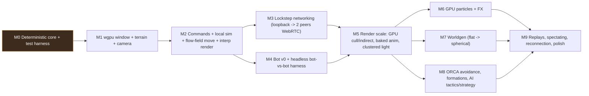
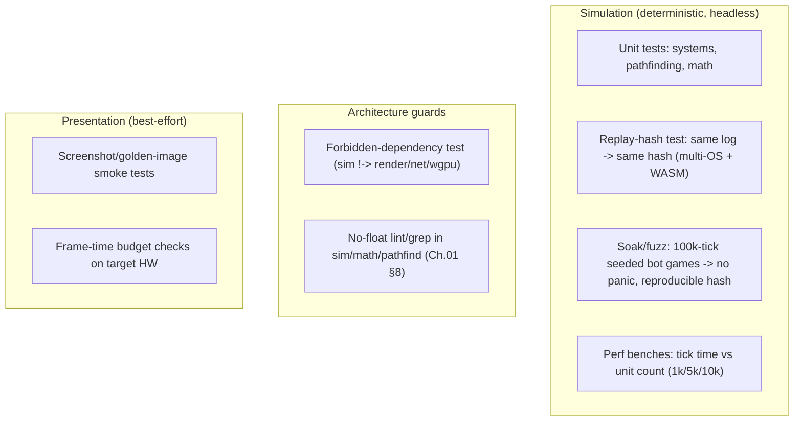

# 10 — Roadmap, Testing & Tooling

[← Back to ARCHITECTURE.md](../ARCHITECTURE.md) · [Prev: AI Bots](09-ai-bots.md)

> How to build it in an order that keeps the two invariants
> ([ARCHITECTURE.md §1](../ARCHITECTURE.md)) verifiable at every step, and the
> tooling that keeps determinism from rotting.

## 1. Guiding principle: prove determinism before pixels

The riskiest assumption in the whole engine is "the sim is bit-identical
everywhere." So **Milestone 0 builds and proves that before any rendering exists.**
Every later milestone keeps the cross-platform replay-hash test
([Ch.01 §8](01-determinism.md)) green — it's the canary for the entire design.

## 2. Milestones

| M | Goal | Key deliverables | Exit criterion |
|---|---|---|---|
| **M0** | Deterministic core | Cargo workspace; `math` (fixed-point + CORDIC, [Ch.01 §2](01-determinism.md)); `DetRng`; SoA `World` skeleton ([Ch.02](02-simulation.md)); state hashing; headless runner + replay-log format ([Ch.03 §6](03-networking-lockstep.md)) | Same command log → **identical state hash on Linux/Windows/macOS/WASM** in CI |
| **M1** | See something | `render` + `winit` window; terrain mesh; RTS camera; instanced cubes for units ([Ch.04](04-rendering-wgpu.md)) | Camera flies over a terrain with placeholder unit instances at 144 FPS |
| **M2** | It's a game (local) | `Command`/`Commander` ([Ch.09 §1](09-ai-bots.md)); select + move; flow-field pathing ([Ch.07 §4](07-pathfinding-navigation.md)); **interpolated** rendering ([ARCHITECTURE.md §4](../ARCHITECTURE.md)) | Select units, right-click, they path there smoothly; sim at 25 Hz, render at 144 |
| **M3** | Multiplayer | `net` + `relay`: loopback lockstep → 2 peers over WebRTC; input delay; desync detection ([Ch.03](03-networking-lockstep.md)) | Two clients play in sync; injecting a float trips the desync detector |
| **M4** | AI + test harness | `BotCommander` v0; **headless bot-vs-bot** as the perf/determinism harness ([Ch.09 §6](09-ai-bots.md)) | Bots play a full match headlessly; runs feed determinism + perf CI |
| **M5** | Scale | GPU cull + indirect draws; LOD; baked-animation atlas ([Ch.05](05-animation.md)); clustered+vertex lighting ([Ch.04 §4](04-rendering-wgpu.md)) | **1000+ animated, lit units at 120–160 FPS** |
| **M6** | Juice | GPU particle system + effect library ([Ch.06](06-particles.md)); dynamic lights from FX | Explosions/muzzle flashes/smoke at scale, within frame budget |
| **M7** | Worlds | Deterministic worldgen, flat then spherical ([Ch.08](08-procedural-generation.md)); `map_hash` handshake | Seed → identical playable map on all peers; spherical `Topology` works |
| **M8** | Smart & smooth | ORCA avoidance + formations ([Ch.07 §5](07-pathfinding-navigation.md)); AI operational + strategic layers + influence maps ([Ch.09 §4](09-ai-bots.md)) | Crowds don't clump; bots macro, expand, and attack competently |
| **M9** | Ship-shape | Replays, spectating, reconnection ([Ch.03 §3,§6](03-networking-lockstep.md)); UI/HUD; audio; settings | Record/watch matches; rejoin after drop; polished build |

> M3 and M4 can proceed in parallel after M2 (different crates, both built on the
> command seam). M6/M7/M8 are largely independent after M5.

## 3. Testing strategy

Determinism makes testing unusually powerful — the sim is a pure function, so
tests are cheap, fast, and exhaustive.

- **The replay-hash test is the keystone** ([Ch.01 §8](01-determinism.md)): a
  recorded command log must reduce to the same state hash on every platform. It
  runs in CI on Linux/Windows/macOS and `wasm32`. If it ever goes red, a
  determinism bug shipped — stop and fix.
- **Bot-vs-bot soak/fuzz** ([Ch.09 §6](09-ai-bots.md)): seeded long matches catch
  rare desyncs, overflow, and panics, and double as performance regression
  benchmarks for the "1000s of units" target.
- **Architecture tests** enforce the wall and the float ban so the invariants
  can't erode silently ([Ch.01 §8](01-determinism.md)).
- **Network tests**: lockstep over a simulated lossy/latent link; verify stalls,
  recovery, drop handling ([Ch.03 §3,§8](03-networking-lockstep.md)).
- **Render tests** are necessarily looser (GPU/driver variance) — golden-image
  smoke tests + frame-budget assertions on reference hardware.

## 4. Tooling & developer experience

| Tool | Purpose |
|---|---|
| **Tracy** (`tracing-tracy`) / **puffin** | Frame + tick profiling; find the 6.9 ms/frame ([Ch.04 §6](04-rendering-wgpu.md)) and per-tick hotspots ([Ch.02 §6](02-simulation.md)) |
| **Desync inspector** | On hash mismatch, dump both peers' serialized state and **diff to the first differing component** ([Ch.01 §6](01-determinism.md)) — the #1 lockstep debugging tool |
| **Replay player** | Re-sim any match, free camera, variable speed ([Ch.03 §6](03-networking-lockstep.md)); also a repro tool for bug reports (attach the tiny command log) |
| **Headless runner** | Run matches with no renderer for CI, fuzzing, AI training ([Ch.02 §8](02-simulation.md), [Ch.09](09-ai-bots.md)) |
| **Worldgen previewer** | Render seeds offline; run fairness/reachability checks ([Ch.08 §5](08-procedural-generation.md)) |
| **Shader hot-reload** | Watch + recompile WGSL in dev ([Ch.04 §5](04-rendering-wgpu.md)) |
| **In-game dev overlay** | Live tick time, FPS, entity counts, current state hash, network RTT/delay, flow-field/influence-map visualizers |
| **Asset baker** | glTF/texture → `rkyv` packs + baked animation atlases ([Ch.04 §3](04-rendering-wgpu.md), [Ch.05 §2](05-animation.md)) |

## 5. CI pipeline (sketch)

Nightly: longer soak/fuzz, more seeds, more unit-count benchmarks, worldgen
fairness sweeps.

## 6. Risk register

| Risk | Mitigation |
|---|---|
| Hidden float / non-determinism creeps into sim | No-float lint + replay-hash CI from M0; desync inspector ([Ch.01](01-determinism.md)) |
| Pathfinding can't hit 1000s of units | Flow fields + HPA* + grid from the start ([Ch.07](07-pathfinding-navigation.md)); perf benches gate it |
| Render can't hit 120–160 FPS at scale | GPU instancing/cull + baked anim + clustered/vertex lighting designed in, not bolted on ([Ch.04](04-rendering-wgpu.md)) |
| WebRTC NAT/connectivity pain | Relay + TURN fallback ([Ch.03 §5](03-networking-lockstep.md)); WS fallback |
| Spherical scope creep | `Topology` trait isolates it; flat ships first ([Ch.07 §2](07-pathfinding-navigation.md)) |
| WASM feature gaps (wgpu/WebRTC) | Treat web as a target in CI from M0; keep to the WebGPU subset ([Ch.04](04-rendering-wgpu.md)) |
| Deterministic parallelism bugs | Single-threaded sim first; parallelize only with double-buffering + fixed-order merges ([Ch.01 §7](01-determinism.md)) |

## 7. Definition of done (for the architecture)

The engine realizes this architecture when:

- the cross-platform **replay-hash test is green** ([Ch.01](01-determinism.md));
- **1000+ animated, lit units** run at **120–160 FPS** ([Ch.04](04-rendering-wgpu.md), [Ch.05](05-animation.md));
- **two+ peers** play a full match in sync over WebRTC with desync detection
  ([Ch.03](03-networking-lockstep.md));
- **bots** play competently and headlessly, powering CI ([Ch.09](09-ai-bots.md));
- **seed-deterministic** flat *and* spherical maps generate identically on all
  peers ([Ch.07](07-pathfinding-navigation.md), [Ch.08](08-procedural-generation.md));
- **replays** reconstruct matches exactly from a tiny command log
  ([Ch.03 §6](03-networking-lockstep.md)).
