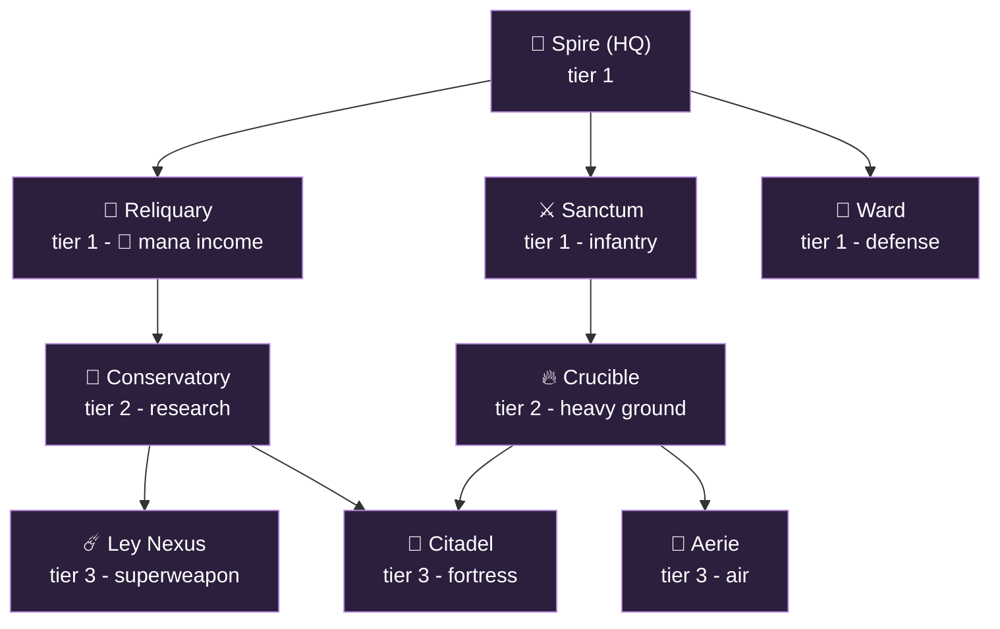
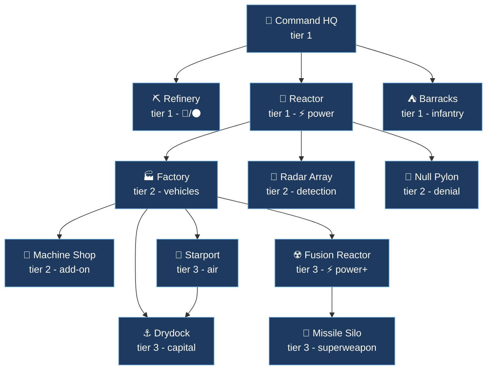

# Tech trees - Astromancers vs Hollowmen

A StarCraft-style **building tech tree** (structures gate other structures, which
gate units and research) for the two launch factions. This is the deep companion
to the roster in [`factions.md`](factions.md) and the lore in
[`story.md`](story.md): that file says *what* each side fields, this one says
*in what order you can build it* and *what each building makes or researches*.

Everything here is design intent, not yet code. The sim today ships only
`Infantry` + `Barracks` and a single `ore` resource (see
[`02-simulation.md`](architecture/02-simulation.md)); the
["maps to the code"](#how-this-maps-to-the-code) section at the end says what is
MVP, what is stretch, and which numbers re-pin the determinism hash.

## Emoji legend

Resources (these appear in every cost column):

| | Resource | What it is |
|---|---|---|
| 🔴 | Ore | bulk material, mined, shared |
| ⚫ | Carbon | advanced material, mined, shared |
| 💧 | Water | mined from ice, shared, feeds both energies |
| 🔮 | Mana | Astromancer energy, a spent stockpile |
| ⚡ | Power | Hollowmen energy, a drawn supply |

Costs read as emoji glued to a number: `🔴150 ⚫50` is 150 ore plus 50 carbon.
Power sits in parentheses: `(⚡3)` is an upkeep **draw**, `(+⚡15)` is supply a
Reactor **adds**. Buildings (🗼 🏢 ...) and units (🧙 💂 ...) each carry a
thematic emoji so you can scan the tree at a glance; faction tags are 🌌 for
Astromancers and ⚙️ for Hollowmen.

---

## The asymmetry, in one screen

Both sides reach a similar power ceiling by **opposite gates**. The tree itself is
the asymmetry, not just the unit art.

| | 🌌 Astromancers | ⚙️ Hollowmen |
|---|---|---|
| **Energy** | 🔮 **Mana**: a spent currency (Reliquaries, water-fed) | ⚡ **Power**: a drawn supply (Reactors, water-cooled) |
| **Shared economy** | 🔴 Ore, ⚫ Carbon, 💧 Water mined off the map | 🔴 Ore, ⚫ Carbon, 💧 Water mined off the map |
| **Worker** | 🌱 **Acolyte** plants a seed; the structure *grows* unattended (slow) | 👷 **Engineer** drives a rig, must stay, can *repair* (fast) |
| **Tree shape** | Two prongs (martial via Sanctum, arcane via Reliquary) that **converge** | One **power-gated** spine with **Factory add-ons** |
| **Defining tech** | Regenerating shields, radiation healing, structures that **uproot and fly** | **Null-fields** (switch off enemy magic) and a one-shot **nuke** |
| **Pace** | Few, expensive, slow to mass, very hard to kill | Many, cheap, fastest reinforcements in the game |
| **Superweapon** | ☄️ **Radiation Bloom**: permanently irradiates terrain (heals Astros, harms others) | 🚀 **Nuclear Strike**: one devastating blast |
| **Detection** | 👁️ **Seeing-Eye** research (units gain detection) | 📡 **Radar Array** building (scan + passive) |

The Hollowmen project a *moment* of destruction; the Astromancers reshape the
*ground* so it fights for them forever after.

---

## The five resources

Three resources are mined off the map by your worker and shared by everyone; two
are **energy**, generated by infrastructure, and *which* energy a faction runs on
is the core asymmetry.

| Resource | Source | 🌌 Astromancers use it for | ⚙️ Hollowmen use it for |
|---|---|---|---|
| 🔴 **Ore** | mined from rock | the bulk of every structure and unit | the bulk of every structure and unit |
| ⚫ **Carbon** | mined from carbon deposits | biomass to grow heavy lifeforms (Golem, Dragon) and advanced structures | composites and propellant for vehicles, aircraft, and the Capital Warship |
| 💧 **Water** | mined from ice | feeds growth and regeneration; ley-springs that let Reliquaries make Mana | reactor coolant and electrolysis feedstock that let Reactors make Power |
| 🔮 **Mana** | generated by Reliquaries / Ley Nexus (water-fed) | spent on casts, shield regen, and the Radiation Bloom | cannot make or use it (magic-deaf) |
| ⚡ **Power** | generated by Reactors / Fusion (water-cooled) | not used (grown structures are alive) | a live supply that gates how much you can run at once (not spent) |

Three things fall out of this table, and they are the heart of the economy:

- **💧 Water is the strategic chokepoint.** Both energy economies run on it:
  Astromancer Mana needs ley-springs (water), Hollowmen Power needs coolant
  (water). Take the ice and you starve the enemy's energy, whichever side they
  are on.
- **Two different economic shapes.** Astromancers run **parallel pools** (Ore for
  the base, Carbon for biomass, Water for growth, Mana for magic) and spend them
  side by side. Hollowmen run a **conversion pipeline** (Water cools and fuels
  Reactors, Reactors supply Power, Power gates Factories that turn Ore and Carbon
  into an army); cut any link and the line stalls.
- **🔮 Mana is spent, ⚡ Power is drawn.** Mana is a stockpile you draw down (a
  cast empties it, shields refill from it). Power is a supply you must not
  over-subscribe (build past your Reactors and everything browns out); it is
  never used up.

Your worker (🌱 Acolyte / 👷 Engineer) gathers the three mined resources from
nodes. Energy is never gathered: it is produced by buildings, so adding it needs
no harvesting code, only per-building income (Mana) or a supply-vs-demand tally
(Power).

### Where the other three factions sit (canon, detailed later)

This doc only details the two launch factions, but the two energy axes generalize
across all five, which is why the resource set is the way it is. Full rosters for
these three are a later pass; their energy canon is set:

| Faction | 🔮 Mana | ⚡ Power | Signature resource |
|---|---|---|---|
| 🐱 Ninefold (cats) | Generate (lunar cycle) | No | ⭐ **Instinct**: an XP pool banked from their own fallen; spent to give *individual* cats new abilities (customize each character) |
| 🐀 Warren (rats) | Scavenge from salvage and the converted dead | No | 🥚 **Genetics**: grows with the population; spent to *pivot the swarm's* traits to counter the enemy |
| 🦑 Rimelings | Cannot produce; **drain it from enemy casters** | Yes (reactors) | none unique (runs on stolen Mana + Power) |

The split tracks the war's alignment: the magic side (Astromancers, cats, rats)
runs on Mana; the anti-magic pact (Hollowmen, Rimelings) runs on Power, with the
parasitic Rimelings straddling both by stealing the Mana they cannot make.

Two of them also carry a **signature progression resource**, and they mirror each
other twice: in income the Ninefold bank ⭐ Instinct from their fallen while the
Warren bank 🥚 Genetics from breeding; in spending the Ninefold customize the
*individual* (Instinct unlocks bespoke abilities on each cat) while the Warren
adapt the *collective* (Genetics pivots the whole swarm to counter the enemy).
Neither pays for raw unit cost, both want a cap, and their full trees are a later
pass.

### How to read the tables

- **Tier** is depth in the tree (1 = buildable from the HQ, 3 = endgame).
- **Requires** lists the structure(s) that must already exist to place this one.
- **Costs** are illustrative starting points to tune, anchored to the sim's
  current `TRAIN_COST = 50` and `STARTING_ORE = 200`, written in the emoji
  shorthand from the legend above.
- Build times are in seconds at the planned 25 Hz tick. All numbers are content,
  not engine, and are expected to move during balance.

---

## 🌌 Astromancers - grown, hovering, maged

*"SCIENTIA EST MAGIA."* Two prongs from the **Spire**: the **Sanctum** line is
your army, the **Reliquary** line is your Mana economy and research. They meet at
the **Citadel** and **Ley Nexus**. Nothing is cheap and nothing is fast, but
shields regenerate, the wounded heal in radiation, and your fortress can pull up
its roots and fly.

### Building tree

### Buildings and prerequisites

| Building | Tier | Requires | Unlocks (summary) | Cost |
|---|---|---|---|---|
| 🗼 **Spire** (HQ) | 1 | - | Acolyte; small Mana trickle; tech root | 🔴400 💧50 |
| 💎 **Reliquary** | 1 | Spire | Mana income (water-fed); gates the arcane prong | 🔴150 💧50 |
| ⚔️ **Sanctum** | 1 | Spire | Magus, Shield-Knight | 🔴150 ⚫25 |
| 🗿 **Ward** | 1 | Spire | Static aether turret (base defense) | 🔴75 |
| 🔥 **Crucible** | 2 | Sanctum | Golem, Hover-tank | 🔴200 ⚫50 |
| 📜 **Conservatory** | 2 | Reliquary | Shield / regen / radiation / detection research | 🔴150 🔮50 |
| 🦅 **Aerie** | 3 | Crucible | Hover-craft, Dragon | 🔴200 ⚫75 🔮50 |
| 🏰 **Citadel** | 3 | Crucible + Conservatory | Top defense; researches Uproot -> Flying Fortress | 🔴250 ⚫50 🔮100 |
| ☄️ **Ley Nexus** | 3 | Conservatory | Big Mana income; researches the Radiation Bloom superweapon | 🔴300 💧100 🔮150 |

### Units

| Unit | Built at | Requires | Role and counters | Cost | Build |
|---|---|---|---|---|---|
| 🌱 **Acolyte** | Spire | - | Worker. Gathers 🔴 / ⚫ / 💧. Plants a structure-seed and walks away; it grows unattended (long grow time). Cannot repair. | 🔴50 | 12s |
| 🧙 **Magus** | Sanctum | - | Line caster infantry, aether-bolts (spends 🔮 per volley). Strong vs clustered infantry; folds inside a null-field. | 🔴50 🔮25 | 18s |
| 🛡️ **Shield-Knight** | Sanctum | - | Staple frontline mech-suit with a **regenerating shield** (refills from your Mana pool). Tanks small-arms; shield is switched off by Hollowmen null-fields. | 🔴100 ⚫25 🔮25 | 24s |
| 👹 **Golem** | Crucible | - | Grown bruiser, huge HP, **no shield** (so null-fields do not touch it). Slow. Soaks damage and breaks lines; kited by ranged. | 🔴150 ⚫75 | 30s |
| 🛸 **Hover-tank** | Crucible | - | Fast hovering armor, arcane cannon. Skirmish and raid; the mobile damage core. Light armor for its tier. | 🔴150 ⚫50 🔮25 | 28s |
| 🛩️ **Hover-craft** | Aerie | - | Skirmisher gunship. Cheap-ish air harass and scouting; dies to dedicated anti-air. | 🔴125 ⚫25 🔮25 | 26s |
| 🐉 **Dragon** | Aerie | - | Tech-outfitted drake, laser breath. Air superiority and bomber. Expensive centerpiece; shielded, regenerates between fights. | 🔴200 ⚫150 🔮100 | 44s |

### Research and upgrades

| Research | At | Requires | Effect | Cost |
|---|---|---|---|---|
| 📈 **Ley-Attunement** | Reliquary | - | +Mana income per Reliquary (compounds the arcane economy). | 🔴100 💧50 |
| ✨ **Greater Bolts** | Sanctum | Conservatory | Magus aether-bolt damage and range up. | 🔴100 🔮75 |
| 🛡️ **Aegis Shells** | Conservatory | - | +shield capacity on every shielded unit (Shield-Knight, Hover-tank, Dragon). | 🔴150 🔮100 |
| ♻️ **Quickening** | Conservatory | - | +shield and HP regeneration rate for all units. | 🔴150 🔮100 |
| ☢️ **Irradiation Adept** | Conservatory | - | Units heal faster and deal more damage while standing in irradiated terrain. | 🔴150 💧50 🔮150 |
| 👁️ **Seeing-Eye** | Conservatory | - | Grants **detection** (reveals cloak / stealth) to a chosen unit class. The answer to the Ninefold. | 🔴150 🔮75 |
| 👹 **Golem-weave** | Crucible | Conservatory | +Golem max HP; +Hover-tank cannon damage. | 🔴150 ⚫75 |
| 🛫 **Uproot** | Citadel | - | The Citadel can lift into a **Flying Fortress**: slow mobile temple with heavy guns, then re-root elsewhere. | 🔴200 🔮150 |
| ☄️ **Radiation Bloom** | Ley Nexus | - | Unlocks the superweapon: irradiate a target area, permanently. Astros there heal and hit harder; everyone else suffers. Big Mana cost per use, long recharge. | 🔴300 💧100 🔮250 |

### Signature plays

- **Grow wide, then turtle hard.** Multiple Reliquaries plus Ley-Attunement fund
  Aegis Shells and Quickening, after which your army practically does not die
  between engagements.
- **Move the fortress.** Uproot a Citadel into a Flying Fortress to relocate your
  hard point onto a contested ice field, then re-root and irradiate around it.
- **Make the map yours.** Radiation Bloom on the central battlefield converts a
  fair fight into a home game permanently.

---

## ⚙️ Hollowmen - conventional, industrial, anti-magic

*"We make our own power."* One spine from the **Command HQ**, gated by **Power**
from Reactors, with tech bolted onto the **Factory** as add-on modules. Cheap,
fast, and relentless: the Hollowmen lose units happily because they replace them
faster than anyone. Their edge is **denial** (null-fields that switch off the
enemy's whole magic kit) and a single, decisive **nuke**.

### Building tree

### Buildings and prerequisites

| Building | Tier | Requires | Unlocks (summary) | Cost |
|---|---|---|---|---|
| 🏢 **Command HQ** | 1 | - | Engineer; tech root | 🔴400 |
| ⛏️ **Refinery** | 1 | HQ | Ore and carbon processing (income) | 🔴125 |
| 🔋 **Reactor** | 1 | HQ | Power supply (water-cooled); gates advanced production | 🔴150 💧50 (+⚡15) |
| ⛺ **Barracks** | 1 | HQ | Powered-Armor Trooper, Dampener Team | 🔴125 (⚡2) |
| 🏭 **Factory** | 2 | Reactor | Main Battle Tank; mounts add-ons | 🔴200 ⚫50 (⚡3) |
| 🔧 **Machine Shop** | 2 | Factory | Add-on: unlocks War-Mech and vehicle research | 🔴100 ⚫25 (⚡1) |
| 📡 **Radar Array** | 2 | Reactor | Detection (scan + passive); the anti-stealth answer | 🔴150 (⚡2) |
| 🚫 **Null Pylon** | 2 | Reactor | Static anti-magic zone (enemy casting and shields fail nearby) | 🔴125 ⚫25 (⚡3) |
| 🛫 **Starport** | 3 | Factory | Gunship, Dropship | 🔴200 ⚫75 (⚡3) |
| ☢️ **Fusion Reactor** | 3 | Factory | Much more Power; gates tier 3 | 🔴250 💧100 (+⚡30) |
| ⚓ **Drydock** | 3 | Starport + Fusion | Capital Warship | 🔴300 ⚫100 (⚡5) |
| 🚀 **Missile Silo** | 3 | Fusion | Builds and launches the Nuke | 🔴400 ⚫50 (⚡4) |

### Units

| Unit | Built at | Requires | Role and counters | Cost | Build |
|---|---|---|---|---|---|
| 👷 **Engineer** | Command HQ | - | Worker. Gathers 🔴 / ⚫ / 💧. Drives a construction rig (must stay on site; fast build) and **repairs** vehicles and buildings. | 🔴50 | 10s |
| 💂 **Powered-Armor Trooper** | Barracks | - | Durable line infantry, laser rifle. The cheap, fast backbone; massed in numbers, melts to splash. | 🔴50 | 14s |
| 🔇 **Dampener Team** | Barracks | Radar Array | Projects a mobile **null-field**: enemy casting fails and magic shields drop inside it. Fragile; the hard counter to Astromancers. | 🔴100 ⚫25 | 22s |
| 🚜 **Main Battle Tank** | Factory | - | The armor backbone; strong direct fire. Anchors a push; vulnerable to air and flanking. | 🔴150 ⚫50 | 26s |
| 🤖 **War-Mech** | Factory | Machine Shop | Heavy walker, anti-everything brawler. The premier ground unit; expensive, slow to replace by Hollowmen standards. | 🔴250 ⚫100 | 38s |
| 🚁 **Gunship** | Starport | - | Laser air support, anti-ground and light anti-air. Mobile firepower; dies to massed dedicated AA. | 🔴175 ⚫50 | 28s |
| ✈️ **Dropship** | Starport | - | Troop and vehicle transport. Enables drops and rapid redeploys; unarmed. | 🔴150 ⚫25 | 24s |
| 🚢 **Capital Warship** | Drydock | - | The big ship: heavy laser batteries. Slow, devastating, a huge investment; focus-fired or out-maneuvered. | 🔴500 ⚫150 | 60s |

### Research and upgrades

| Research | At | Requires | Effect | Cost |
|---|---|---|---|---|
| 🎯 **Focusing Lenses** | Barracks | - | +Trooper and Dampener laser damage. | 🔴100 |
| 💉 **Combat Stims** | Barracks | Machine Shop | Temporary fire-rate and move-speed boost, paid in HP. Aggressive timing tech. | 🔴100 ⚫25 |
| 🚫 **Null Saturation** | Barracks | Radar Array | Bigger, stronger null-field radius on Dampener Teams and Null Pylons. | 🔴150 ⚫25 |
| 🛡️ **Composite Plating** | Machine Shop | - | +armor on all vehicles. | 🔴125 ⚫25 |
| 💥 **Siege Mode** | Machine Shop | - | Tanks can deploy into long-range siege artillery (cannot move while deployed). | 🔴150 ⚫25 |
| 📡 **Sensor Net** | Radar Array | - | +passive detection radius; reveals more of the map around your forces. | 🔴100 |
| 🔦 **Scanner Sweep** | Radar Array | - | Active ability: briefly reveal any area (anti-stealth, anti-fog scouting). | 🔴100 |
| 🔥 **Afterburners** | Starport | - | +air unit move speed. | 🔴125 ⚫25 |
| 🔌 **Load Balancing** | Reactor | Fusion Reactor | Reduces Power upkeep across all buildings (run more at once). | 🔴150 |
| ☢️ **Nuclear Strike** | Missile Silo | - | Builds a Nuke (long build, high ore + carbon); launch designates a target for a single devastating blast. | 🔴500 ⚫100 per nuke |

### Signature plays

- **Out-produce, out-spend.** Refineries plus cheap Barracks mean you trade
  armies all day; Load Balancing lets the factories never stop.
- **Switch off the magic.** A Dampener Team (or a wall of Null Pylons) at the
  front turns shielded Astromancer elites into ordinary, killable metal, then the
  tanks do the rest.
- **End it.** Park a Fusion Reactor and a Missile Silo behind a Null Pylon wall
  and force the enemy to break a fortified base before the Nuke lands.

---

## Side-by-side asymmetry summary

| Pillar | 🌌 Astromancers | ⚙️ Hollowmen |
|---|---|---|
| Energy | 🔮 Mana (a spent stockpile) via Reliquaries | ⚡ Power (a drawn supply) via Reactors |
| Mined economy | 🔴 Ore, ⚫ Carbon, 💧 Water (shared) | 🔴 Ore, ⚫ Carbon, 💧 Water (shared) |
| Economy shape | Parallel pools spent side by side | Conversion pipeline (water -> power -> army) |
| Build mechanic | Seed-and-grow (slow, fire-and-forget) | Rig-build (fast, must stay, repairs) |
| Production tech | Separate research building (Conservatory) | Add-on modules on the Factory |
| Frontline | Regenerating shields + radiation healing | Cheap mass + armor + stims |
| Hard counter they fear | Null-fields drop their shields and casts | Anything that ignores attrition (shields, splash) |
| Mobility trick | Flying Fortress (uproot and re-root) | Dropship drops and Afterburner air |
| Detection | 👁️ Seeing-Eye research | 📡 Radar Array building |
| Superweapon | ☄️ Radiation Bloom (persistent terrain) | 🚀 Nuclear Strike (one blast) |
| Tempo | Slow, elite, turtle-and-snowball | Fast, expendable, relentless pressure |

---

## How this maps to the code

The sim today (`crates/sim/src/lib.rs`) models exactly one unit (`Infantry`), one
building (`Barracks`), one resource (`ore` as a per-building trickle), and a
`Command::Train` with a flat `TRAIN_COST`. To grow toward this design, in rough
dependency order:

1. **Name the kinds.** Extend `protocol::UnitKind` and `protocol::BuildingKind`
   with the rosters above, and map them to `sim::Kind` plus a `stats(kind)` row.
   This alone re-pins the golden hash in
   `crates/testkit/tests/determinism.rs` because `state_hash` writes the kind tag.
2. **Add prerequisites.** A build / train command should check that the owner has
   the required building(s) alive before it is accepted (mirrors the existing ore
   check in `apply_commands`). The trees above are the requirement tables.
3. **Add the resource pools.** Ore already exists. Add **Carbon** and **Water**
   as two more shared per-player pools like `ore`; add **Mana** as an
   Astromancer pool (a spent stockpile, like ore) and **Power** as a Hollowmen
   supply-vs-demand check (a gate, not a stockpile). All fixed-point, all folded
   into `state_hash`, which re-pins the golden value (see the determinism rules
   in `CLAUDE.md`).
4. **Harvesting is the bigger lift.** Carbon and Water imply resource-node
   entities plus a `Gather` order and a worker that carries (none of which exist
   yet). Mana and Power do **not**: they are produced by buildings, so they fit
   the existing per-building trickle / tally with almost no new plumbing.
5. **Costs are content, not engine.** Every number here is a starting point.
   Because ore (and any new pool) is hashed, tuning a single cost changes the
   golden hash by design - regenerate it with
   `cargo run -p testkit --bin demo_hash`.

### Suggested MVP slice (jam scope)

Ship **two resources, not five**: keep mined 🔴 **Ore** (already there) and add
only the faction **energy** (🔮 Mana for Astromancers, ⚡ Power for Hollowmen),
because both are building-generated and need no harvesting code. Defer ⚫ Carbon
and 💧 Water (and their nodes / gather logic) to a later pass.

- **🌌 Astromancers:** Spire, Reliquary, Sanctum -> Acolyte, Magus,
  Shield-Knight, with Magus bolts and Shield-Knight shields both drawing on the
  Mana pool.
- **⚙️ Hollowmen:** Command HQ, Reactor, Barracks, Factory -> Engineer,
  Powered-Armor Trooper, Main Battle Tank, with Power gating production and a
  Dampener Team that drops Astromancer shields.

That is two workers, four-plus combat units, a real prerequisite chain, and the
core asymmetry (spent Mana vs drawn Power, shields vs null-fields) all exercised.
The Carbon/Water economy, Crucible/Conservatory/air/superweapon tiers are stretch.

---

## Open questions

- **Power model.** Is Hollowmen Power a hard cap (cannot build past supply, like
  StarCraft) or a soft brownout (over-draw slows production, like C&C)? The tree
  works either way; the brownout reads more "industrial."
- **Harvesting vs trickle.** Should Ore / Carbon / Water be genuinely gathered
  (worker carries from nodes to a drop-off) or stay a per-building trickle like
  ore is today? Gathering is more of an RTS but a real chunk of new sim code.
- **Two resources or five for the jam.** The MVP slice above ships two; confirm
  whether Carbon and Water make the first playable or wait.
- **Water as a single chokepoint.** Both energies leaning on Water makes ice
  decisive, maybe too decisive. Option: only the *upgraded* energy tiers (Ley
  Nexus, Fusion) need Water, so losing ice caps you rather than starves you.
- **Mana ceiling.** Does Mana bank without limit, or cap (so you cannot stockpile
  ten superweapons' worth)? A cap keeps it tactical.
- **Add-ons as entities or flags.** Is the Machine Shop a separate building
  entity attached to a Factory, or a per-Factory boolean upgrade? Entity is more
  StarCraft-faithful; flag is far less sim plumbing.
- **Superweapon parity.** Radiation Bloom (persistent zone) and Nuclear Strike
  (one blast) are deliberately different shapes. Confirm both ship at launch, or
  cut to one per side for the jam.
- **Flying Fortress scope.** Uproot is a lot of movement and re-root plumbing for
  a structure. Worth it for flavor, but a clear stretch goal.
