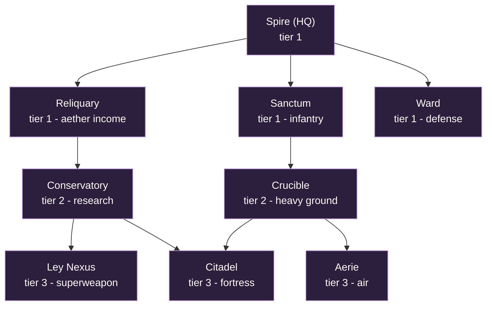
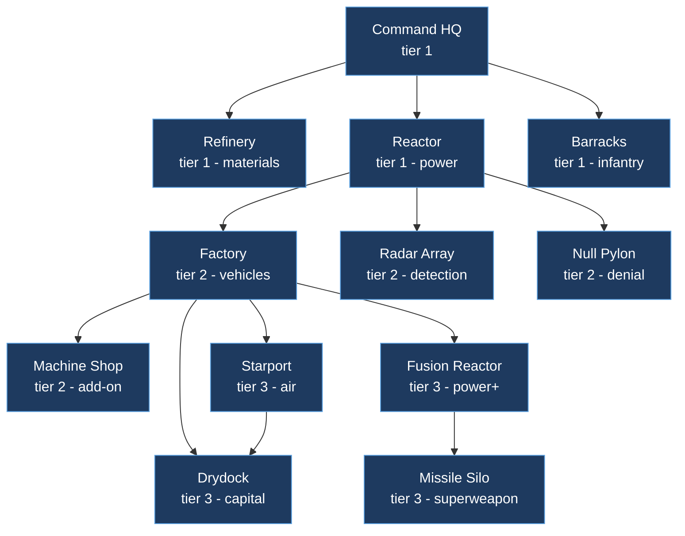

# Tech trees - Astromancers vs Hollowmen

A StarCraft-style **building tech tree** (structures gate other structures, which
gate units and research) for the two launch factions. This is the deep companion
to the roster in [`factions.md`](factions.md) and the lore in
[`story.md`](story.md): that file says *what* each side fields, this one says
*in what order you can build it* and *what each building makes or researches*.

Everything here is design intent, not yet code. The sim today ships only
`Infantry` + `Barracks` and a single `ore` resource (see
[`02-simulation.md`](architecture/02-simulation.md)); the
["maps to the code"](#how-this-maps-to-the-code) section at the end says what is
MVP, what is stretch, and which numbers re-pin the determinism hash.

---

## The asymmetry, in one screen

Both sides reach a similar power ceiling by **opposite gates**. The tree itself is
the asymmetry, not just the unit art.

| | Astromancers | Hollowmen |
|---|---|---|
| **Second axis** | A spent currency: **aether** | A capped utility: **power** |
| **You build it with** | Reliquaries (aether income) | Reactors (power supply) |
| **What it does** | Paid out per cast, per shield-tick, per superweapon | Gates how much you can run at once; not spent |
| **Worker** | **Acolyte** plants a seed and leaves; the structure *grows* on its own (slow) | **Engineer** drives a rig and must stay; construction is *fast* and the rig can repair |
| **Tree shape** | Two prongs (martial via Sanctum, arcane via Reliquary) that **converge** at the top | One spine, **power-gated**, with **factory add-ons** bolting tech onto production |
| **Defining tech** | Regenerating shields, radiation healing, structures that **uproot and fly** | **Null-fields** (switch off enemy magic) and a one-shot **nuke** |
| **Pace** | Few, expensive, slow to mass, very hard to kill | Many, cheap, fastest reinforcements in the game |
| **Superweapon** | **Radiation Bloom**: permanently irradiates terrain (heals Astros, harms others) - persistent map control | **Nuclear Strike**: one devastating blast - a moment, not a place |
| **Answer to stealth** | **Seeing-Eye** research (units gain detection) | **Radar Array** building (scan + passive detection) |

Read that last-but-one row twice: it is the cleanest expression of the two
peoples. The Hollowmen project a *moment* of destruction; the Astromancers
reshape the *ground* so it fights for them forever after.

### How to read the tables

- **Tier** is depth in the tree (1 = buildable from the HQ, 3 = endgame).
- **Requires** lists the structure(s) that must already exist to place this one.
- **Costs** are illustrative starting points to tune, anchored to the sim's
  current `TRAIN_COST = 50` and `STARTING_ORE = 200`:
  - **M** = materials (the existing `ore`).
  - **A** = aether (Astromancers only; a spent pool).
  - **P** = power (Hollowmen only; an upkeep draw against Reactor supply, **not**
    spent). A negative P (Reactors) *adds* supply.
- Build times are in seconds at the planned 25 Hz tick. All numbers are content,
  not engine, and are expected to move during balance.

---

## Astromancers - grown, hovering, maged

*"SCIENTIA EST MAGIA."* Two prongs from the **Spire**: the **Sanctum** line is
your army, the **Reliquary** line is your magic economy and research. They meet
at the **Citadel** and **Ley Nexus**. Nothing is cheap and nothing is fast, but
shields regenerate, the wounded heal in radiation, and your fortress can pull up
its roots and fly.

### Building tree

### Buildings and prerequisites

| Building | Tier | Requires | Unlocks (summary) | Cost |
|---|---|---|---|---|
| **Spire** (HQ) | 1 | - | Acolyte; small aether trickle; tech root | 400 M |
| **Reliquary** | 1 | Spire | Aether income; gates the arcane prong | 150 M |
| **Sanctum** | 1 | Spire | Magus, Shield-Knight | 150 M |
| **Ward** | 1 | Spire | Static aether turret (base defense) | 75 M |
| **Crucible** | 2 | Sanctum | Golem, Hover-tank | 200 M |
| **Conservatory** | 2 | Reliquary | Shield / regen / radiation / detection research | 150 M, 50 A |
| **Aerie** | 3 | Crucible | Hover-craft, Dragon | 200 M, 50 A |
| **Citadel** | 3 | Crucible + Conservatory | Top-tier defense; researches Uproot -> Flying Fortress | 250 M, 100 A |
| **Ley Nexus** | 3 | Conservatory | Big aether income; researches the Radiation Bloom superweapon | 300 M, 150 A |

### Units

| Unit | Built at | Requires | Role and counters | Cost | Build |
|---|---|---|---|---|---|
| **Acolyte** | Spire | - | Worker. Plants a structure-seed and walks away; it grows unattended (long grow time). Cannot repair. | 50 M | 12s |
| **Magus** | Sanctum | - | Line caster infantry, aether-bolts. Spends **A** per volley. Strong vs clustered infantry; folds inside a null-field. | 50 M, 10 A | 18s |
| **Shield-Knight** | Sanctum | - | Staple frontline mech-suit with a **regenerating shield**. Tanks small-arms; the shield is shut off by Hollowmen null-fields (then it is just a so-so mech). | 100 M, 25 A | 24s |
| **Golem** | Crucible | - | Grown bruiser, huge HP, **no shield** (so null-fields do not touch it). Slow. Soaks damage and breaks lines; kited by ranged. | 150 M | 30s |
| **Hover-tank** | Crucible | - | Fast hovering armor, arcane cannon. Skirmish and raid; the mobile damage core. Light armor for its tier. | 175 M, 25 A | 28s |
| **Hover-craft** | Aerie | - | Skirmisher gunship. Cheap-ish air harass and scouting; dies to dedicated anti-air. | 150 M, 25 A | 26s |
| **Dragon** | Aerie | - | Tech-outfitted drake, laser breath. Air superiority and bomber. Expensive centerpiece; shielded, regenerates between fights. | 300 M, 100 A | 44s |

### Research and upgrades

| Research | At | Requires | Effect | Cost |
|---|---|---|---|---|
| **Ley-Attunement** | Reliquary | - | +aether income per Reliquary (compounds the arcane economy). | 100 M, 50 A |
| **Greater Bolts** | Sanctum | Conservatory | Magus aether-bolt damage and range up. | 100 M, 75 A |
| **Aegis Shells** | Conservatory | - | +shield capacity on every shielded unit (Shield-Knight, Hover-tank, Dragon). | 150 M, 100 A |
| **Quickening** | Conservatory | - | +shield and HP regeneration rate for all units. | 150 M, 100 A |
| **Irradiation Adept** | Conservatory | - | Units heal faster and deal more damage while standing in irradiated terrain. The signature "fight on our ground" tech. | 200 M, 150 A |
| **Seeing-Eye** | Conservatory | - | Grants **detection** (reveals cloak / stealth) to a chosen unit class. The faction's answer to the Ninefold. | 150 M, 75 A |
| **Golem-weave** | Crucible | Conservatory | +Golem max HP; +Hover-tank cannon damage. | 150 M, 50 A |
| **Uproot** | Citadel | - | The Citadel can lift into a **Flying Fortress**: slow mobile temple with heavy guns, then re-root elsewhere. | 250 M, 150 A |
| **Radiation Bloom** | Ley Nexus | - | Unlocks the superweapon: irradiate a target area, permanently. Astros there heal and hit harder; everyone else suffers. Big aether cost per use, long recharge. | 300 M, 250 A |

### Signature plays

- **Grow wide, then turtle hard.** Multiple Reliquaries plus Ley-Attunement fund
  Aegis Shells and Quickening, after which your army practically does not die
  between engagements.
- **Move the fortress.** Uproot a Citadel into a Flying Fortress to relocate your
  hard point onto a contested expansion, then re-root and irradiate around it.
- **Make the map yours.** Radiation Bloom on the central battlefield converts a
  fair fight into a home game permanently.

---

## Hollowmen - conventional, industrial, anti-magic

*"We make our own power."* One spine from the **Command HQ**, gated by **power**
from Reactors, with tech bolted onto the **Factory** as add-on modules. Cheap,
fast, and relentless: the Hollowmen lose units happily because they replace them
faster than anyone. Their edge is **denial** (null-fields that switch off the
enemy's whole magic kit) and a single, decisive **nuke**.

### Building tree

### Buildings and prerequisites

| Building | Tier | Requires | Unlocks (summary) | Cost |
|---|---|---|---|---|
| **Command HQ** | 1 | - | Engineer; tech root | 400 M |
| **Refinery** | 1 | HQ | Materials income | 125 M |
| **Reactor** | 1 | HQ | Power supply; gates all advanced production | 150 M (-10 P, supplies power) |
| **Barracks** | 1 | HQ | Powered-Armor Trooper, Dampener Team | 125 M, 2 P |
| **Factory** | 2 | Reactor | Main Battle Tank; mounts add-ons | 200 M, 3 P |
| **Machine Shop** | 2 | Factory | Add-on: unlocks War-Mech and vehicle research | 100 M, 1 P |
| **Radar Array** | 2 | Reactor | Detection (scan + passive); the anti-stealth answer | 150 M, 2 P |
| **Null Pylon** | 2 | Reactor | Static anti-magic zone (enemy casting and shields fail nearby) | 125 M, 3 P |
| **Starport** | 3 | Factory | Gunship, Dropship | 200 M, 3 P |
| **Fusion Reactor** | 3 | Factory | Much more power; gates tier 3 | 250 M (-20 P, supplies power) |
| **Drydock** | 3 | Starport + Fusion | Capital Warship | 300 M, 5 P |
| **Missile Silo** | 3 | Fusion | Builds and launches the Nuke | 400 M, 4 P |

### Units

| Unit | Built at | Requires | Role and counters | Cost | Build |
|---|---|---|---|---|---|
| **Engineer** | Command HQ | - | Worker. Drives a construction rig (must stay on site; fast build) and **repairs** vehicles and buildings. | 50 M | 10s |
| **Powered-Armor Trooper** | Barracks | - | Durable line infantry, laser rifle. The cheap, fast backbone; massed in numbers, melts to splash. | 50 M | 14s |
| **Dampener Team** | Barracks | Radar Array | Projects a mobile **null-field**: enemy casting fails and magic shields drop inside it. Fragile; the hard counter to Astromancers. | 100 M, 1 P | 22s |
| **Main Battle Tank** | Factory | - | The armor backbone; strong direct fire. Anchors a push; vulnerable to air and flanking. | 150 M, 1 P | 26s |
| **War-Mech** | Factory | Machine Shop | Heavy walker, anti-everything brawler. The premier ground unit; expensive, slow to replace by Hollowmen standards. | 250 M, 2 P | 38s |
| **Gunship** | Starport | - | Laser air support, anti-ground and light anti-air. Mobile firepower; dies to massed dedicated AA. | 175 M, 2 P | 28s |
| **Dropship** | Starport | - | Troop and vehicle transport. Enables drops and rapid redeploys; unarmed. | 150 M, 1 P | 24s |
| **Capital Warship** | Drydock | - | The big ship: heavy laser batteries. Slow, devastating, a huge investment; focus-fired or out-maneuvered. | 500 M, 5 P | 60s |

### Research and upgrades

| Research | At | Requires | Effect | Cost |
|---|---|---|---|---|
| **Focusing Lenses** | Barracks | - | +Trooper and Dampener laser damage. | 100 M |
| **Combat Stims** | Barracks | Machine Shop | Temporary fire-rate and move-speed boost, paid in HP. Aggressive timing tech. | 100 M, 1 P |
| **Null Saturation** | Barracks | Radar Array | Bigger, stronger null-field radius on Dampener Teams and Null Pylons. | 150 M, 2 P |
| **Composite Plating** | Machine Shop | - | +armor on all vehicles. | 125 M |
| **Siege Mode** | Machine Shop | - | Tanks can deploy into long-range siege artillery (cannot move while deployed). | 150 M, 1 P |
| **Sensor Net** | Radar Array | - | +passive detection radius; reveals more of the map around your forces. | 100 M |
| **Scanner Sweep** | Radar Array | - | Active ability: briefly reveal any area (anti-stealth, anti-fog scouting). | 100 M |
| **Afterburners** | Starport | - | +air unit move speed. | 125 M, 1 P |
| **Load Balancing** | Reactor | Fusion Reactor | Reduces power upkeep across all buildings (run more at once). | 150 M |
| **Nuclear Strike** | Missile Silo | - | Builds a Nuke (long build, high M); launch designates a target for a single devastating blast. The superweapon. | 500 M per nuke |

### Signature plays

- **Out-produce, out-spend.** Refineries plus cheap Barracks mean you trade
  armies all day; Load Balancing lets the factories never stop.
- **Switch off the magic.** A Dampener Team (or a wall of Null Pylons) at the
  front turns shielded Astromancer elites into ordinary, killable metal, then the
  tanks do the rest.
- **End it.** Park a Fusion Reactor and a Missile Silo behind a Null Pylon wall
  and force the enemy to break a fortified base before the Nuke lands.

---

## Side-by-side asymmetry summary

| Pillar | Astromancers | Hollowmen |
|---|---|---|
| Economy gate | Aether (spent) via Reliquaries | Power (capped) via Reactors |
| Build mechanic | Seed-and-grow (slow, fire-and-forget) | Rig-build (fast, must stay, repairs) |
| Production tech | Separate research building (Conservatory) | Add-on modules on the Factory |
| Frontline | Regenerating shields + radiation healing | Cheap mass + armor + stims |
| Hard counter they fear | Null-fields drop their shields and casts | Anything that ignores attrition (shields, splash) |
| Mobility trick | Flying Fortress (uproot and re-root) | Dropship drops and Afterburner air |
| Detection | Seeing-Eye research | Radar Array building |
| Superweapon | Radiation Bloom (persistent terrain) | Nuclear Strike (one blast) |
| Tempo | Slow, elite, turtle-and-snowball | Fast, expendable, relentless pressure |

---

## How this maps to the code

The sim today (`crates/sim/src/lib.rs`) models exactly one unit (`Infantry`), one
building (`Barracks`), one resource (`ore`), and a `Command::Train` with a flat
`TRAIN_COST`. To grow toward this design, in rough dependency order:

1. **Name the kinds.** Extend `protocol::UnitKind` and `protocol::BuildingKind`
   with the rosters above, and map them to `sim::Kind` plus a `stats(kind)` row.
   This alone re-pins the golden hash in
   `crates/testkit/tests/determinism.rs` because `state_hash` writes the kind tag.
2. **Add prerequisites.** A `Command::Train` / build should check that the
   owner has the required building(s) alive before it is accepted (mirrors the
   existing ore check in `apply_commands`). The tree above is the requirement
   table.
3. **Add the second axis.** Astromancer **aether** is a second per-player pool
   like `ore` (spent on casts, shields, superweapon); Hollowmen **power** is a
   per-player supply-vs-demand check (a gate, not a stockpile). Both are
   fixed-point and both must be folded into `state_hash`, which re-pins the
   golden value (see the determinism rules in `CLAUDE.md`).
4. **Costs are content, not engine.** Every M / A / P number here is a starting
   point. Because ore (and any new pool) is hashed, tuning a single cost changes
   the golden hash by design - regenerate it with
   `cargo run -p testkit --bin demo_hash`.

### Suggested MVP slice (jam scope)

The leanest vertical slice that still reads as two asymmetric factions:

- **Astromancers:** Spire, Reliquary, Sanctum -> Acolyte, Magus, Shield-Knight,
  with one aether-spending ability (Magus bolt) and regenerating shields.
- **Hollowmen:** Command HQ, Reactor, Barracks, Factory -> Engineer,
  Powered-Armor Trooper, Main Battle Tank, with power as a production gate and a
  Dampener Team that drops Astromancer shields.

That is two workers, four-plus combat units, a real prerequisite chain, and the
core asymmetry (aether-currency vs power-gate, shields vs null-fields) all
exercised. Crucible/Conservatory/air/superweapon tiers are stretch.

---

## Open questions

- **Power model.** Is Hollowmen power a hard cap (cannot build past supply, like
  StarCraft) or a soft brownout (over-draw slows production, like C&C)? The tree
  works either way; the brownout reads more "industrial."
- **Aether one pool or many.** One global aether stockpile per player is
  simplest and matches `ore`. Tracking it per Reliquary (local draw) is richer
  but heavier. Recommend one pool for the jam.
- **Add-ons as entities or flags.** Is the Machine Shop a separate building
  entity attached to a Factory, or a per-Factory boolean upgrade? Entity is more
  StarCraft-faithful; flag is far less sim plumbing.
- **Superweapon parity.** Radiation Bloom (persistent zone) and Nuclear Strike
  (one blast) are deliberately different shapes. Confirm both should exist at
  launch, or cut to one per side for the jam.
- **Flying Fortress scope.** Uproot is a lot of movement and re-root plumbing for
  a structure. Worth it for flavor, but a clear stretch goal.
