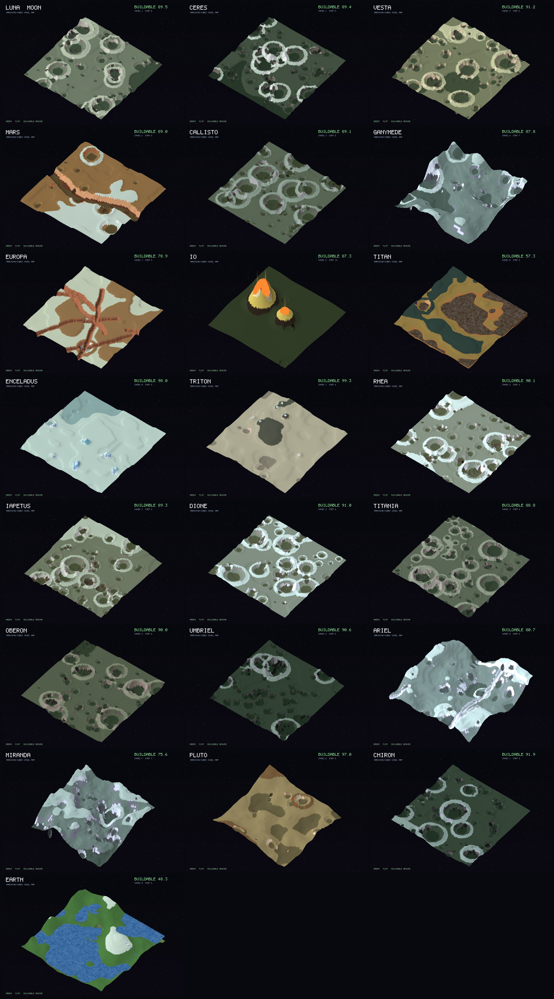

# World generation: battlefields across the Solar System

[← Back to ARCHITECTURE.md](ARCHITECTURE.md) · See also [Ch.08 Procedural Map Generation](architecture/08-procedural-generation.md)

The game can be fought over real Solar System bodies. This page documents the
**22 battlefield worlds** (the 21 listed bodies plus **Earth**), the **texture
archetypes** they share, the **map hazards** and **landforms** on each, and the
**marching-cubes voxel terrain** that builds them. Everything here is
presentation-side (floats / assets); none of it touches the deterministic sim
(see [`CLAUDE.md`](../CLAUDE.md), "two worlds, one wall").

- Catalog + generator: [`assets/worldgen/`](../assets/worldgen/) (pure Python stdlib)
- Baked map files: [`assets/maps/<key>.vxl`](../assets/maps/) (static, editable)
- Texture sets: [`assets/textures/worlds/`](../assets/textures/worlds/)
- NASA references: [`worldgen/nasa_references.json`](worldgen/nasa_references.json)

## The worlds at a glance



Each map is a sculpted 3D **density grid** meshed with **marching cubes**, not a
heightmap. That is deliberate: terraced plateaus give large, flat, buildable
tops, the tier boundaries become crisp cliffs, and there are no high-frequency
heightmap spikes. Going fully 3D also allows caves and overhangs, which a
heightmap cannot represent. Green in the previews marks the relatively flat,
**buildable** ground.

## Terrain design: buildable, not spiky

The brief: a guaranteed share of relatively flat, buildable ground; plateaus and
cliffs are good; spikes are not. The recipe (`densitygen.py`):

1. A smooth, **low-frequency** base surface (no fine noise), plus a few wide,
   shallow craters with flat floors (never spikes).
2. **Terracing** into a few big elevation tiers: gentle slopes snap to flat
   plateau tops separated by short cliff risers.
3. **Smoothing for variability:** blend the hard terraces back toward the smooth
   base (per-world `TERRACE_MIX`), then box-blur the height field (`SMOOTH`
   passes). This rounds the cliffs/ridges marching cubes would otherwise render
   as hard facets, and mixes plateaus with rolling ground for varied terrain.
4. **Features**, added *after* smoothing so they stay crisp: prominent impact
   craters, Europa fissures, the Mars canyon, Io's volcanoes, geysers.
5. **Voxelize** to a density field; **carve** a few caves/arches into steep
   ground; mark the per-column **buildable mask** (the flat, dry tops).

The smoothing makes terrain gently rolling rather than hard-faceted, so buildable
fractions are high: most worlds ~88-99%, with the feature-heavy ones lower - Io
~87%, Europa ~79%, Miranda ~76%, Titan ~57%, Earth ~48% (roughly half ocean).

### Landforms by erosion

What carves each world depends on how it is eroded, which drives both cratering
and its signature feature:

- **Airless rock/dust (no erosion): mostly FLAT, relief from CRATERS.** Moon,
  Ceres, Vesta, Callisto, Rhea, Dione, Iapetus, Titania, Oberon, Umbriel, Chiron
  are flat plains saturated with impact craters (bowls + raised rims + bright
  ejecta rays); the flat ground between them is buildable.
- **Ice-resurfaced (few craters):** Europa gets long, deep **fissures** (lineae);
  Enceladus and Triton get **small volcano-like cryo-geysers** (cones with vents
  and plumes); Triton also gets cantaloupe terrain; Ganymede / Ariel / Miranda
  get grooves and rifts.
- **Volcanic:** Io is a **mostly flat** sulfur plain studded with **giant towering
  volcanoes** - cones with summit calderas, glowing lava and eruption plumes.
- **Atmospheric:** Mars is fairly plain with one big central **canyon** (Valles
  Marineris); **Titan** has **oceans of liquid methane** amid dune-toned
  highlands; **Earth** has **oceans, lakes and rivers** over green continents and
  mountain ranges.

Liquid (methane on Titan, water on Earth) is stored per-column in the map and
drawn as a flat liquid surface; columns under liquid are not buildable.

## Texture archetypes

Many bodies share a look (barren cratered rock, dirty ice), so they are grouped
into archetypes; a few are unique. A per-world tint, seed and terrain recipe make
each distinct, so Ganymede's cool grooved ice never reads like the Moon's warm
grey rock, and Europa's red-brown lineae never look like Enceladus's blue tiger
stripes.

| archetype | look | worlds |
| --------- | ---- | ------ |
| `regolith_grey` | Airless grey rock (lunar / large-asteroid / Uranian-moon regolith) | moon, vesta, titania, oberon |
| `regolith_dark` | Dark carbonaceous rock, bright salt accents | ceres, umbriel, chiron |
| `dirty_ice` | Cratered brown-grey ice with cool, bright icy highs | callisto, rhea, iapetus, dione |
| `grooved_ice` | Dark ice cut by bright bluish grooves (sulci) | ganymede, ariel, miranda |
| `bright_ice` | Brilliant fresh ice, blue fracture accents | enceladus |
| `europa_ice` | UNIQUE: bright tan ice scored by red-brown lineae + chaos | europa |
| `mars_rust` | UNIQUE: rusty dust and basalt, bright polar ice | mars |
| `io_sulfur` | UNIQUE: sulfur over black volcanism, red pyroclastics | io |
| `titan_haze` | UNIQUE: orange organic haze, dark dunes, methane lakes | titan |
| `triton_ice` | UNIQUE: pinkish nitrogen ice, cantaloupe terrain | triton |
| `pluto_tholin` | UNIQUE: tan tholins beside bright nitrogen plains | pluto |
| `earth` | UNIQUE: green continents + rock highlands + snow, with blue oceans/lakes/rivers | earth |

Each archetype ships four tileable tiles (`base`, `low`, `high`, `accent`) for
texturing the mesh; the previews colour the mesh from the same palettes.

## The full catalog (buildable % and map hazards)

| world | archetype | buildable | landforms / map hazards | NASA reference |
| ----- | --------- | --------- | ----------------------- | -------------- |
| Luna (Moon) | `regolith_grey` | 90% | flat plains; prominent cratering; basalt maria | LRO (PIA23237) |
| Ceres | `regolith_dark` | 89% | flat; prominent cratering; brine eruptions (faculae) | Dawn (PIA21078) |
| Vesta | `regolith_grey` | 91% | flat; prominent cratering; cliffs/scarps | Dawn (PIA15140) |
| Mars | `mars_rust` | 89% | one big central canyon; dust storms; polar frost | Viking / MRO (PIA00565) |
| Callisto | `dirty_ice` | 89% | flat; prominent cratering; radiation | Galileo (PIA03456) |
| Ganymede | `grooved_ice` | 88% | grooved sulci; radiation; ice rifts | Galileo / Juno (PIA05077) |
| Europa | `europa_ice` | 79% | long deep fissures (lineae); chaos; radiation | Galileo (PIA00294) |
| Io | `io_sulfur` | 87% | mostly smooth; a few large volcanoes; lava; plumes | Galileo / Voyager 1 (PIA02509) |
| Titan | `titan_haze` | 57% | oceans of liquid methane; haze; dunes | Cassini / Huygens (PIA12778) |
| Enceladus | `bright_ice` | 98% | small cryo-geyser cones (tiger stripes); ice rifts | Cassini (PIA03551) |
| Triton | `triton_ice` | 99% | cryo-geyser cones (N2 plumes); cantaloupe terrain | Voyager 2 (PIA00056) |
| Rhea | `dirty_ice` | 90% | flat; prominent cratering; ice cliffs | Cassini (PIA21904) |
| Iapetus | `dirty_ice` | 89% | flat; prominent cratering; albedo dichotomy | Cassini (PIA21347) |
| Dione | `dirty_ice` | 91% | flat; prominent cratering; wispy ice cliffs | Cassini (PIA21349) |
| Titania | `regolith_grey` | 89% | flat; prominent cratering; fault canyons | Voyager 2 (PIA01361) |
| Oberon | `regolith_grey` | 90% | flat; prominent cratering; dark crater floors | Voyager 2 (PIA00034) |
| Umbriel | `regolith_dark` | 91% | flat; prominent cratering; bright Wunda ring | Voyager 2 (PIA00040) |
| Ariel | `grooved_ice` | 81% | rift valleys + fissures; scarps | Voyager 2 (PIA00037) |
| Miranda | `grooved_ice` | 76% | chaotic grooves/rifts; Verona Rupes cliffs | Voyager 2 (PIA18185) |
| Pluto | `pluto_tholin` | 97% | nitrogen glaciers (Sputnik Planitia); frost; cryovolcano | New Horizons (PIA09234) |
| Chiron | `regolith_dark` | 92% | flat; prominent cratering; comet jets (outgassing) | Deep Space 1 analog (PIA03865) |
| Earth | `earth` | 33% | oceans, lakes and rivers; mountains; weather | Landsat / Blue Marble |

### Hazard glossary

Hazards are declared per world in `worlds.py` (and meant to drive gameplay terrain
effects): **lava lakes / volcanic plumes** (Io), **methane seas** (Titan),
**cryo-geysers** (Enceladus, Triton, Pluto), **ice rifts / chaos / grooves**
(Europa, Ganymede, Ariel, Miranda, Enceladus), **dust storms** (Mars, Titan),
**brine eruptions** (Ceres), **cliffs / scarps** (Miranda, Vesta, Dione, the
Uranian moons), **albedo dichotomy / equatorial ridge** (Iapetus), **nitrogen
glaciers** (Pluto), **radiation** (the Jovian moons), and **comet jets** (Chiron).

## The map file format (`.vxl`)

A baked map is a tiny, documented container (`voxel.py`). The canonical, editable
artifact is the raw density grid:

```
magic   "VXL1"                     4 bytes
nx ny nz                           3 x uint16  (grid dims; y is up)
x0 x1 y0 y1 z0 z1                  6 x int16   (world-space bounds)
flat_permil                        uint16      (buildable fraction * 1000)
sea_level                          int16       (liquid plane world-y; -32768 = none)
payload = zlib( density[nx*ny*nz] + material[nx*ny*nz]
                + buildable[nx*nz] + liquid[nx*nz] )
          density: uint8 (>=128 solid),  material: uint8,
          buildable: uint8 mask,  liquid: uint8 per-column surface (j+1, 0 = dry)
```

The 22 maps total well under 1 MB. Edit later with the ops on `VoxelGrid`
(`fill_box`, `carve_sphere`, ...), `python3 assets/worldgen/voxel.py <map.vxl>`
to inspect, or any tool that speaks VXL1.

## Engine integration

The deterministic sim is flat 2D fixed-point, so the chosen design is a
**marching-cubes mesh + cliffs for the look, with buildability derived from the
baked `buildable` mask on a 2.5D plane**. Implemented in
[`apps/client/src/voxel.rs`](../apps/client/src/voxel.rs):

- Parses the embedded `.vxl` maps (zlib via `miniz_oxide`, wasm-friendly), runs
  marching cubes to a coloured mesh, and exposes `surface_height(x, z)`.
- When a map is selected (`voxel::ACTIVE`, default none), `gfx.rs` draws that
  mesh (via the vertex-coloured unit pipeline) instead of the heightmap terrain
  and ocean, and `terrain.rs` sits units on `surface_height`. Tests parse and
  mesh all 21 maps; CI (fmt / clippy / test / wasm) is green.
- The default keeps the existing Earthlike map, so the live build is unchanged
  until a battlefield is selected.

Remaining, determinism-sensitive follow-up: feeding the buildable mask and a 3D
surface into the deterministic sim for in-sim pathing/building. Anything the sim
consumes must be fixed-point and re-pins the golden hash, so it is staged
carefully rather than rushed. (The parameterized heightmap procgen in
`apps/client/src/worlds.rs` remains as a lightweight fallback.)

## Regenerating

```sh
python3 assets/worldgen/build.py            # textures + baked maps + previews
python3 assets/worldgen/build.py --fetch    # also refresh the NASA references (network)
python3 assets/worldgen/render3d.py moon io # fast subset preview
python3 assets/worldgen/bake.py             # just the .vxl maps
```

See [`assets/worldgen/README.md`](../assets/worldgen/README.md) for the module
breakdown.

## Imagery credit

Palettes are tuned to match real spacecraft imagery: NASA / JPL-Caltech and
partner missions (LROC, Dawn, Galileo, Cassini-Huygens, Voyager 2, Juno, New
Horizons, Deep Space 1, Hubble). Most NASA imagery is public domain; see the NASA
[media usage guidelines](https://www.nasa.gov/multimedia/guidelines/). The
generated tiles, maps and previews here are original procedural art, not NASA
imagery.
