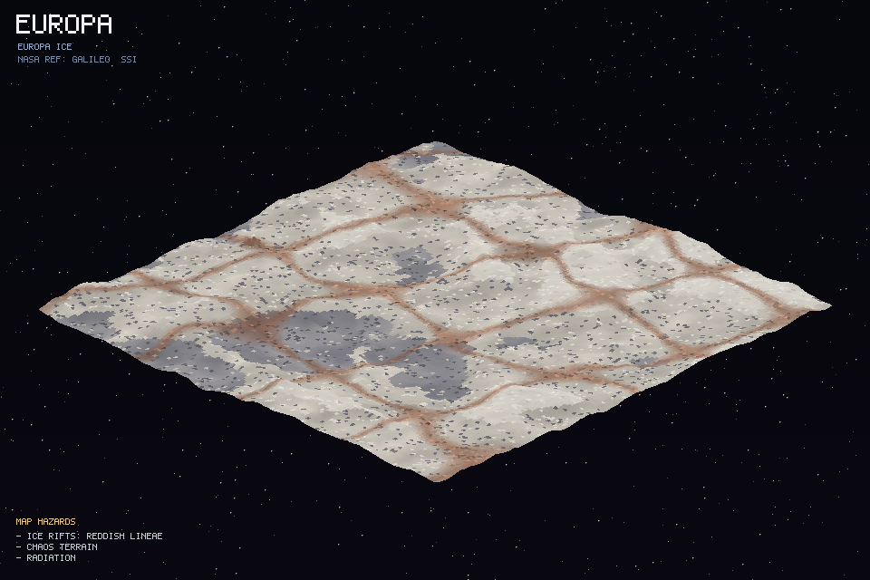
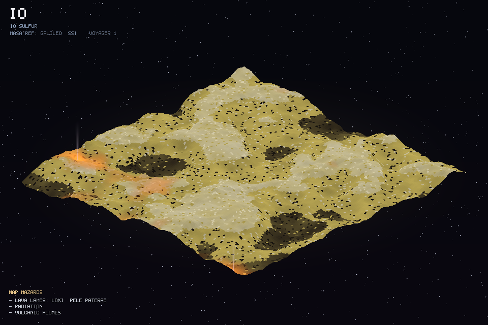
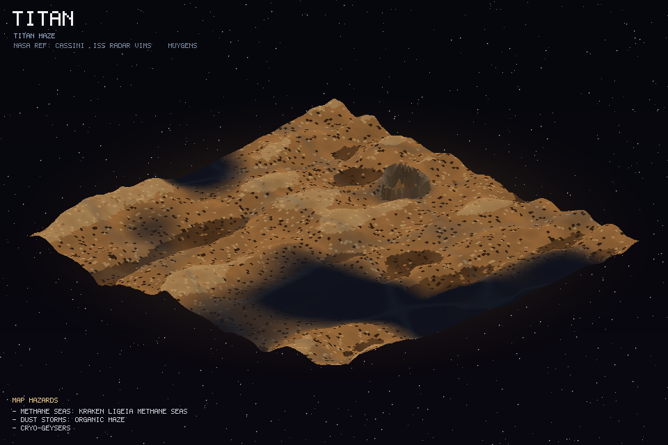
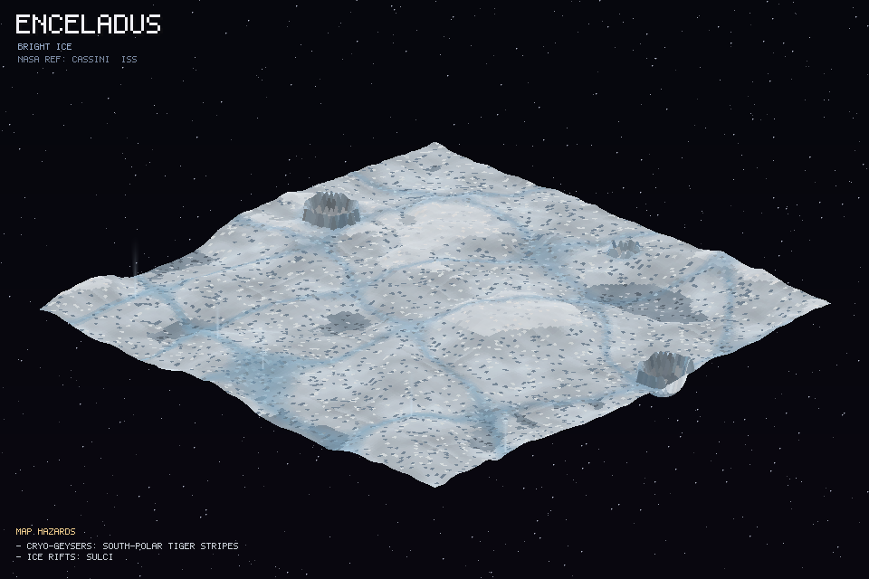

# World generation: battlefields across the Solar System

[← Back to ARCHITECTURE.md](ARCHITECTURE.md) · See also [Ch.08 Procedural Map Generation](architecture/08-procedural-generation.md)

The game can be fought over real Solar System bodies. This page documents the
**21 battlefield worlds**, the **texture archetypes** they share, the **map
hazards** on each, and the **procedural terrain** that builds them. Everything is
presentation-side (floats / assets); none of it touches the deterministic sim
(see [`CLAUDE.md`](../CLAUDE.md), "two worlds, one wall").

- Catalog + generator: [`assets/worldgen/`](../assets/worldgen/) (pure Python stdlib)
- Texture sets: [`assets/textures/worlds/`](../assets/textures/worlds/)
- Engine procgen mirror: [`apps/client/src/worlds.rs`](../apps/client/src/worlds.rs)
- NASA references: [`worldgen/nasa_references.json`](worldgen/nasa_references.json)

## The worlds at a glance


Many of these bodies share a look (barren cratered rock, dirty ice), so they are
grouped into a handful of **texture archetypes**; a few are visually unique and
get their own. A per-world tint, seed and terrain recipe then make each distinct,
so (for example) the cool, grooved ice of Ganymede never reads like the warm grey
rock of the Moon, and Europa's red-brown lineae never look like Enceladus's blue
tiger stripes.

| archetype | look | worlds |
| --------- | ---- | ------ |
| `regolith_grey` | Airless grey rock (lunar / large-asteroid / Uranian-moon regolith) | moon, vesta, titania, oberon |
| `regolith_dark` | Dark carbonaceous rock, bright salt accents | ceres, umbriel, chiron |
| `dirty_ice` | Cratered brown-grey ice with cool, bright icy highs | callisto, rhea, iapetus, dione |
| `grooved_ice` | Dark ice cut by bright bluish grooves (sulci) | ganymede, ariel, miranda |
| `bright_ice` | Brilliant fresh ice, blue fracture accents | enceladus |
| `europa_ice` | UNIQUE: bright tan ice scored by red-brown lineae + chaos | europa |
| `mars_rust` | UNIQUE: rusty dust and basalt, bright polar ice | mars |
| `io_sulfur` | UNIQUE: sulfur over black volcanism, red pyroclastics | io |
| `titan_haze` | UNIQUE: orange organic haze, dark dunes, methane lakes | titan |
| `triton_ice` | UNIQUE: pinkish nitrogen ice, cantaloupe terrain | triton |
| `pluto_tholin` | UNIQUE: tan tholins beside bright nitrogen plains | pluto |

Each archetype ships four tileable tiles (`base`, `low`, `high`, `accent`) that
drop straight into the client's existing four-sampler terrain shader.

## Four that are wholly unique

| | | |
| --- | --- | --- |
|  |  | |
| **Europa** - smooth young ice, red-brown lineae, chaos terrain | **Io** - sulfur plains, black lava lakes, eruption plumes | |
|  |  | |
| **Titan** - orange haze, dune seas, dark methane lakes | **Enceladus** - fresh ice, south-polar cryo-geysers | |

(Per-world full-resolution previews are in [`worldgen/previews/`](worldgen/previews/).)

## The full catalog (with map hazards)

| world | archetype | map hazards | NASA reference |
| ----- | --------- | ----------- | -------------- |
| Luna (Moon) | `regolith_grey` | basalt maria; ray craters | Lunar Reconnaissance Orbiter (PIA23237) |
| Ceres | `regolith_dark` | brine eruptions (faculae); ray craters | Dawn (PIA21078) |
| Vesta | `regolith_grey` | cliffs/scarps; ray craters | Dawn (PIA15140) |
| Mars | `mars_rust` | dust storms; polar frost; canyon scarps | Viking / MRO (PIA00565) |
| Callisto | `dirty_ice` | radiation; ray craters | Galileo (PIA03456) |
| Ganymede | `grooved_ice` | radiation; ice rifts | Galileo / Juno (PIA05077) |
| Europa | `europa_ice` | ice rifts (lineae); chaos terrain; radiation | Galileo (PIA00294) |
| Io | `io_sulfur` | lava lakes; radiation; volcanic plumes | Galileo / Voyager 1 (PIA02509) |
| Titan | `titan_haze` | methane seas; organic haze; cryo-geysers | Cassini / Huygens (PIA12778) |
| Enceladus | `bright_ice` | cryo-geysers (tiger stripes); ice rifts | Cassini (PIA03551) |
| Triton | `triton_ice` | cryo-geysers (N2 plumes); polar frost | Voyager 2 (PIA00056) |
| Rhea | `dirty_ice` | ray craters; ice cliffs | Cassini (PIA21904) |
| Iapetus | `dirty_ice` | equatorial ridge; albedo dichotomy | Cassini (PIA21347) |
| Dione | `dirty_ice` | wispy ice cliffs (chasmata); ray craters | Cassini (PIA21349) |
| Titania | `regolith_grey` | fault canyons (Messina); ray craters | Voyager 2 (PIA01361) |
| Oberon | `regolith_grey` | dark crater floors; scarps | Voyager 2 (PIA00034) |
| Umbriel | `regolith_dark` | bright Wunda ring; radiation | Voyager 2 (PIA00040) |
| Ariel | `grooved_ice` | graben rift valleys; scarps | Voyager 2 (PIA00037) |
| Miranda | `grooved_ice` | Verona Rupes (~20 km cliff); coronae rifts | Voyager 2 (PIA18185) |
| Pluto | `pluto_tholin` | nitrogen glaciers (Sputnik Planitia); frost; cryovolcano | New Horizons (PIA09234) |
| Chiron | `regolith_dark` | comet jets (outgassing); ray craters | Deep Space 1 analog (PIA03865) |

### Hazard glossary

Hazards are declared per world in `worlds.py` and rendered into the previews
(and meant to drive gameplay terrain effects):

- **lava lakes / volcanic plumes** (Io): glowing molten paterae and eruption jets.
- **methane seas** (Titan): still, dark hydrocarbon lakes pooled in the lowlands.
- **cryo-geysers** (Enceladus, Triton, Pluto): icy/nitrogen jets along fractures.
- **ice rifts / chaos / grooves** (Europa, Ganymede, Ariel, Miranda, Enceladus):
  fractured, resurfaced terrain (Europa's reddish lineae, the others' sulci).
- **dust storms** (Mars, Titan haze): wind-blown haze sweeping the surface.
- **brine eruptions** (Ceres): bright salt deposits (Occator-style faculae).
- **cliffs / scarps** (Miranda, Vesta, Dione, Iapetus, the Uranian moons): big drops.
- **albedo dichotomy / equatorial ridge** (Iapetus): a dark hemisphere and a ridge.
- **nitrogen glaciers** (Pluto): flat, bright resurfaced plains.
- **radiation** (the Jovian moons): an environmental hazard zone.
- **comet jets** (Chiron): sublimation outgassing from an icy-rock centaur.

## How the terrain is generated

`render.py` builds each world from its recipe in `worlds.py`, then shades it with
the world's texture set and draws hazards on top. The recipe knobs:

```
relief        overall vertical scale          grooves/groove_dir   parallel sulci ridges
roughness     fbm detail                      rifts                thin fractures / graben
warp          domain-warp strength            dunes/dune_dir       aeolian ripple fields
crater_*      impact crater density/size      calderas             volcanic floors (Io)
smoothness    resurfacing (fewer craters)     cantaloupe           dimpled terrain (Triton)
                                              plains               flat resurfaced basins
                                              ridge                equatorial ridge (Iapetus)
```

The pipeline per world: layered value-noise heightfield (with domain warp) ->
add grooves / dunes / cantaloupe / ridge / plains -> rasterize impact craters
(bowl + raised rim + ejecta) -> derive material & hazard masks -> oblique,
hill-shaded render sampling the texture set, with hazard overlays (lava glow,
flat dark lakes, geyser/jet plumes, sweeping dust haze) and a label + hazard
legend baked in. It is deterministic: same catalog in, byte-identical assets out.

This mirrors the staged worldgen pipeline in
[Ch.08](architecture/08-procedural-generation.md); the previews are produced
without a GPU (a tiny software heightfield renderer) so the look can be verified
in CI-friendly, headless environments.

### In the engine

[`apps/client/src/worlds.rs`](../apps/client/src/worlds.rs) is the engine-side
mirror of the terrain recipes (same knobs, `f32`). `terrain.rs` uses it when a
world is selected:

```rust
// apps/client/src/worlds.rs
pub const ACTIVE: usize = usize::MAX; // out of range -> default Earthlike map
// set to an index from WORLDS (0 = Moon, 7 = Io, 8 = Titan, ...) to fight there
```

The default keeps the existing Earthlike map. Wiring the per-world texture sets
and hazard rendering all the way through the wgpu pipeline (the previews show the
target look) is the natural next step.

## Regenerating

```sh
python3 assets/worldgen/build.py            # textures + previews + contact sheet
python3 assets/worldgen/build.py --fetch    # also refresh the NASA references (network)
```

See [`assets/worldgen/README.md`](../assets/worldgen/README.md) for details.

## Imagery credit

Palettes are tuned to match real spacecraft imagery: NASA / JPL-Caltech and
partner missions (LROC, Dawn, Galileo, Cassini-Huygens, Voyager 2, Juno, New
Horizons, Deep Space 1, Hubble). Most NASA imagery is public domain; see the NASA
[media usage guidelines](https://www.nasa.gov/multimedia/guidelines/). The
generated tiles and previews here are original procedural art, not NASA imagery.
